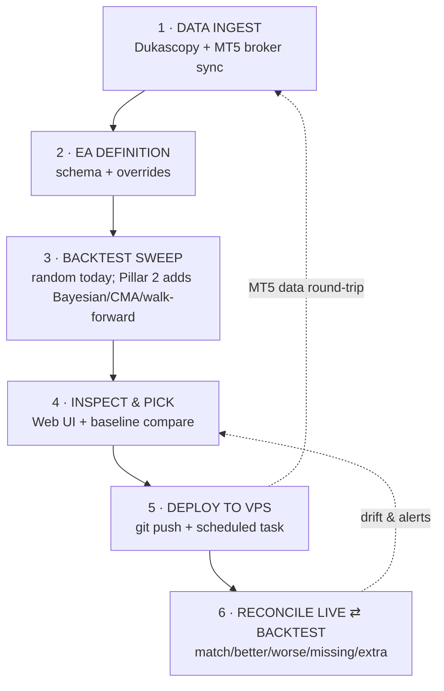

# Fire Forex — Architecture Map

> Living map of every tracked file in the repo, audited against what each piece is supposed to do. Top of file = first thing the system does. Bottom = unbuilt pillars 2–6.

## Verdict legend

- ✅ working as intended
- ⚠️ partial — known gap or needs hardening
- ❌ broken — does not deliver what its name implies
- 🔘 not started — placeholder for unbuilt component

## End-to-end flow

Stages 1–6 below.

## 1 · DATA INGEST

**Supposed to:** Pull historical price data from two sources (Dukascopy public archive + MT5 broker terminal), keep parquet stores in sync, run health checks, and derive per-(pair, TF) volatility defaults that drive the rest of the system.

| Component | Path | Supposed to | Verdict | Notes |
|---|---|---|---|---|
| Data package init | `ff/data/__init__.py` | Re-export `date_slice`, `health`, `inventory` | ✅ | One-liner; nothing to break. |
| UTC date clipping | `ff/data/date_slice.py` | Clip a DataFrame to a `[start, end]` UTC window, inclusive, with end-of-day expansion when only a date is given | ✅ | Pure utility; pandas-version aware. |
| Retired bar API | `ff/data/downloader.py` | Tombstone — raises `ImportError` on import | ✅ | Intentional: upstream Dukascopy bar API returns null rows in `dukascopy_python` 3.x/4.x. Kept as an explicit barrier so stale imports fail loud. Replacements: `m1_bi5_downloader` + `resample.derive_higher_tfs`. |
| Pair groups (UI) | `ff/data/groups.py` | Single source of truth for Majors / Crosses / Metals / Indices / Crypto headings in the Data tab | ✅ | Static data; consumed by `app/`. |
| Parquet health check | `ff/data/health.py` | NaN / OHLC sanity / timestamp ordering / gap detection (with FX weekend mask) | ✅ | Returns roll-up `ok/warn/fail` per file. Pandas 3.0 `asi8` change handled via `to_numpy.view('i8')`. |
| Parquet inventory | `ff/data/inventory.py` | Scan known data roots, headers-only, with 1-hour TTL cache to `artifacts/data_inventory.json` | ✅ | Drives the Data tab list. Cache TTL hard-coded — fine. |
| Dukascopy M1 downloader | `ff/data/m1_bi5_downloader.py` | Per-day `.bi5` → LZMA → struct unpack → `{pair}_M1.parquet` (BID/ASK + computed spread) | ✅ | Replaces broken `dukascopy_python`. Empirically verified against GBP_USD 2024-06-03 sample. |
| MT5 M1 downloader | `ff/data/mt5_m1_downloader.py` | Mirror of bi5 downloader for MT5 broker terminal — same parquet shape into `BackTestData_MT5/` | ⚠️ | Pair-coverage gap: only pairs the laptop's MT5 market-watch includes get pulled (memory `project_mt5_replay_pair_coverage.md`). Windows-only (MetaQuotes binary). |
| Resampler | `ff/data/resample.py` | `tick_to_m1` + `derive_higher_tfs` — TICK → M1 → M5/M15/M30/H1/H4/D/W with forex-correct OHLCV aggregation, atomic `.partial` writes | ✅ | Preserves DatetimeIndex on merge (memory `feedback_resample_merge_preserves_history.md` — earlier wipe-history bug fixed). |
| Dukascopy tick downloader | `ff/data/tick_downloader.py` | Hourly `.bi5` tick files → unpack → `{pair}_TICK.parquet`, append-only beyond existing max ts | ✅ | Stdlib + pandas only. JPY/non-JPY scale handled. |
| ATR-driven defaults | `ff/defaults/volatility.py` | Median 14-bar ATR per (pair, TF) → derive stop / target / trailing ranges as ATR multiples; cached to `artifacts/volatility_cache.json` | ✅ | `ATR_RULES` is the single point of extension for new pair-aware knobs. |
| MT5 fetch CLI | `scripts/fetch_mt5_history.py` | One-pair MT5 fetch + fan-out to higher TFs via `resample.derive_higher_tfs` | ✅ | Argparse CLI; UTF-8 stdout reconfigured for Windows cp1252. |
| Volatility cache | `artifacts/volatility_cache.json` *(gitignored runtime)* | Cache the truth of computed ATR ranges (CLAUDE.md: cache is truth, `pair_tf.yaml` is fallback) | ✅ | Not tracked — runtime artifact rebuilt from parquet. |
| Three-tier data architecture | _(unbuilt)_ | Dukascopy / MT5 / merged tiers with explicit provenance per row, so Stage 3 sweeps can run on any tier | 🔘 | Designed (memory `Three-Tier Data Architecture for Live-Backtest Parity`); blocks 100% reconcile parity. Lands as part of Pillar 5 dependencies. |
| Automated data integrity check | _(unbuilt)_ | Detect gaps / corrupt bars / future-dated bars across all roots and alert | 🔘 | `health.py` checks per-file on demand; no scheduled sweep. Pillar 3 (safety). |

**Flows down to Stage 2** via `ff.harness.load_parquet` (called from the EA-build path) and `ff.defaults.volatility.derive_ranges` (supplies default ranges to the schema layer).
**Flows up from Stage 5** via the MT5 broker round-trip — `mt5_m1_downloader` + `fetch_mt5_history.py` pull live broker data back to the laptop, enabling the dual backtest the future-architecture sketch describes.

## 2 · EA DEFINITION

**Supposed to:** Declare an EA as a schema of knobs (signals + engine + execution + data), let the user pick a complexity level or load an existing config, apply per-knob overrides from the UI, and flatten the result into the `(NUM_PL,)` float64 row the Rust engine consumes.

| Component | Path | Supposed to | Verdict | Notes |
|---|---|---|---|---|
| EAs package init | `eas/__init__.py` | Package marker for example EA fixtures | ✅ | |
| Baseline schema (JSON) | `eas/baseline.json` | Pinned-baseline EA schema as plain data so the UI can load it | ✅ | Data file. |
| Baseline EA | `eas/baseline.py` | Minimal EA: ATR SL + RR TP, all hours / Mon-Fri. Provides `ENGINE_MAPPING` for the Rust slot layout | ✅ | Reference implementation; keeps the surface tiny so regressions show up clearly. |
| complex01 schema (JSON) | `eas/complex01.json` | Complex EA schema (~22 tunable dims when every group is ON) | ✅ | Data file consumed by the UI. |
| complex01 EA | `eas/complex01.py` | The fixture EA: full ENGINE_MAPPING with categorical SL selector, multi-arm branches, breakeven / trailing groups | ✅ | The fixture used in goldens, demos, and `add-forex-knob` flows. |
| Defaults package init | `ff/defaults/__init__.py` | Package marker | ✅ | |
| `complexity_to_ea` | `ff/defaults/complexity.py` | Build a Fire Forex EA from a 1..10 complexity level using `pair_tf.yaml` as the per-(pair, main_tf) range table | ✅ | Result is a strict subset of `complex01`'s shape — the structural-validity guarantee. |
| `apply_overrides` | `ff/defaults/overrides.py` | Apply UI overrides (`groups` / `knobs` / `global` / `signal_families`) to an already-built EA, returning a new EA with originals untouched | ✅ | All keys optional; unknown paths ignored (see CLAUDE.md "Overrides shape"). |
| Pair / TF fallback table | `ff/defaults/pair_tf.yaml` | Hand-written per-(pair, main_tf) knob ranges used when the volatility cache is unavailable | ✅ | Don't edit without reason — volatility cache is the truth. |
| Rust slot encoder | `ff/encoding.py` | Map a sampled trial dict → `(NUM_PL,)` float64 row using `(slot_index, encoder_fn)` pairs declared per-EA. NUM_PL = 27. | ✅ | Encodes the foot-guns from `ff_core` (signal-variant disable = -1, days bitmask, SL/TP/Trailing modes) as defaults. |
| Random sampler | `ff/sampler.py` | Random uniform / log-uniform / discrete sampling over the EA schema, deterministic per seed | ⚠️ | Random only. No Bayesian / CMA-ES / walk-forward yet — Pillar 2. |
| Schema primitives | `ff/schema.py` | `FloatRange` / `IntRange` / `Choice` / `Group` / `Branch` dataclasses; defines knob composition semantics | ✅ | Frozen dataclasses; group-off semantics correctly suppress sub-knobs. |
| Schema JSON ser/de | `ff/schema_json.py` | `node_to_dict` / `dict_to_ea` — bridge dataclasses to plain JSON so the UI can save / load EAs | ✅ | `engine_mapping` is intentionally NOT serialised (callable references); supplied separately. |
| Bayesian sampler (Optuna) | _(unbuilt)_ | Smart sampler — same trial budget, far better best-trial than random | 🔘 | Pillar 2. |
| CMA-ES sampler | _(unbuilt)_ | Evolutionary sampler for continuous knobs | 🔘 | Pillar 2. |
| Walk-forward sampler | _(unbuilt)_ | Rolling in-sample / out-of-sample wrapper around any of the above | 🔘 | Pillar 2 + Pillar 3 (kills overfitting flatter). |

**Flows up from Stage 1** via `ff.defaults.volatility.derive_ranges` which supplies pair / TF-aware default ranges into `complexity_to_ea`.
**Flows down to Stage 3** via `ff.encoding.encode_trial` — each sampled trial is flattened to the `(NUM_PL,)` row consumed by `ff_core` (Rust engine).

## 3 · BACKTEST SWEEP

**Supposed to:** Build the signal library, sample N trial parameter sets, run them through the Rust engine in parallel, compute per-trial metrics, pick the best, and persist run artifacts (`artifacts/runs/*.npz` + `artifacts/history.csv`) for the UI.

| Component | Path | Supposed to | Verdict | Notes |
|---|---|---|---|---|
| Rust crate manifest | `core/Cargo.toml` | Declare `ff_core` crate, deps (pyo3, numpy, rayon), build profile | ✅ | Also referenced from Appendix H. |
| Rust lockfile | `core/Cargo.lock` | Pin exact dep versions | ✅ | Tracked so reproducible builds. |
| Engine constants | `core/src/constants.rs` | DIR / SL / TP / TRAIL / EXIT mode codes; **must stay in sync with `ff_core` slot constants** | ✅ | Single source of truth for the Rust↔Python contract on mode codes. |
| Time filter | `core/src/filter.rs` | `signal_passes_time_filter` — hours start/end (with wrap-around) + days bitmask (Mon=bit 0) | ✅ | Pure function; trivially correct. |
| Engine entrypoint | `core/src/lib.rs` | pyo3 module, `batch_evaluate` parallelised over rayon, panic-safe boundary | ⚠️ | Crate-wide `allow(dead_code)` lists `SL_FIXED_PIPS / TP_RR_RATIO / TRAIL_ATR_CHANDELIER / M_DSR / tp_pips` as reserved for upcoming variants. Comment explicitly says "to be reviewed in the architecture stocktake". This is now that review — decide per-name in a follow-on PR. |
| Metric computation | `core/src/metrics.rs` | `compute_metrics_inline` — all metrics for one trial, including PSR via `norm_cdf` | ⚠️ | Norm CDF via Abramowitz & Stegun 7.1.26; max abs err ~1.5e-7 — sufficient for ranking. Issue #14 (`win_rate` vs `win_rate_pct` mismatch) cuts across this + harness + UI. |
| SL/TP computation | `core/src/sl_tp.rs` | `compute_sl_tp` — derive SL/TP prices from mode codes + ATR pips + entry price | ✅ | NaN sentinel for missing swing_sl handled correctly. |
| Trade simulator | `core/src/trade_full.rs` | `simulate_trade_full` — one trade end-to-end with trailing, breakeven, partial close, stale exit, max bars | ⚠️ | Issue #13 — out-of-bounds risk on `sig_bar_index` (CodeRabbit critical + minor). Tracked. |
| Exit-code translation | `ff/exit_codes.py` | Numeric exit-reason codes → human names (`SL`, `TP`, `TRAILING`, ...) | ✅ | Mirrors `core/src/constants.rs` EXIT_* — must stay in sync; defensive `UNKNOWN` fallback. |
| Run harness | `ff/harness.py` | End-to-end orchestrator: load data → build signal library → sample → encode → call `ff_core.batch_evaluate` → save NPZ + history.csv → regenerate `comparison.html` | ⚠️ | The 11-step flow defined in module docstring. Heartbeat thread + parallel build (≥500 trials) per memory `project_speed_phases_1_2_3.md`. Cost-realism fields persist raw + adjusted P&L plus `gate_save_pips` / `cost_overhead_pips` decomposition. Issue #14 (`win_rate` mismatch) affects reporting. |
| Pre-flight estimator | `ff/preflight.py` | Estimate library combo count + sweep time + effective dimensionality before paying for a long run | ✅ | Heuristic; `SIGNAL_BUILD_SEC_PER_COMBO = 0.25` may drift over time. |
| Signal library | `ff/signal_lib.py` | Family registry + Cartesian-product expansion of per-family parameter grids → pooled `SignalSet` with stable variant IDs sorted by bar index | ✅ | Now keeps zero-signal variants so variant IDs stay stable across builds (memory `Signal Library Now Keeps Zero-Signal Variants for Stable Variant IDs`). |
| Bayesian sweep (Optuna) | _(unbuilt)_ | Plug-in optimiser feeding the harness — same trial budget, smarter sampling | 🔘 | Pillar 2. |
| CMA-ES sweep | _(unbuilt)_ | Evolutionary optimiser for continuous knobs | 🔘 | Pillar 2. |
| Walk-forward orchestration | _(unbuilt)_ | Roll the sweep over expanding/sliding train+test windows | 🔘 | Pillar 2 + 3. |
| Monte Carlo robustness | _(unbuilt)_ | Re-run a winning trial with seed/spread/order perturbations to get confidence bands | 🔘 | Pillar 3. |

**Flows up from Stage 2** via the encoded `(N, NUM_PL)` float64 matrix that `ff.encoding.encode_trial` produces; the harness picks one row per trial and ships it through `ff_core.batch_evaluate`.
**Flows down to Stage 4** via `artifacts/runs/{layer}_{stamp}.npz` (per-run trial outputs) and `artifacts/history.csv` (one row per run); the Web UI reads both for baseline comparison.

## 4 · INSPECT & PICK (Web UI)

**Supposed to:** Show every knob of every EA in plain English, run sweeps as one-at-a-time background jobs, persist a pinned baseline run, and let the user compare each new run against that baseline. Local-only on `127.0.0.1` — never hosted.

| Component | Path | Supposed to | Verdict | Notes |
|---|---|---|---|---|
| Web app package init | `app/__init__.py` | Package marker | ✅ | |
| FastAPI app entry | `app/api.py` | Mount router + static files; bind 127.0.0.1 only; kick the live-state daemon | ✅ | Docstring's `uvicorn app.api:api` is the user-run command (`scripts/ff_restart_server.ps1`) — Claude must never spawn uvicorn (`.claude/rules/trading.md`). |
| Pinned baseline storage | `app/baselines.py` | Persist a baseline snapshot to `artifacts/baseline.json` with `_KPI_KEYS` (trades, win_rate_pct, total_pips, expectancy_pips, max_dd_pct, profit_factor, sharpe, return_pct) | ⚠️ | Issue #14 — `win_rate_pct` here vs `win_rate` elsewhere in the engine / harness. Real bug, tracked. |
| One-at-a-time job runner | `app/jobs.py` | Single-slot background runner with `threading.Lock`; rebuilds EA from recipe server-side so engine-mapping callables never round-trip JSON | ✅ | 409 on concurrent POST. Heartbeat callback updates progress. |
| API request/response shapes | `app/models.py` | Pydantic models for `RunRequest`, `JobProgress`, `DefaultsRequest`, etc. | ✅ | Type-safe API surface. |
| Pair / TF scanner | `app/pairs_scan.py` | Thin adapter around `ff.data.inventory` so legacy callers don't break | ✅ | Cached scan; lives outside `ff/` because it's HTTP-adjacent. |
| HTTP endpoints | `app/routes.py` | All `/api/*` endpoints — defaults, run, jobs, baseline, instances, EA catalog, docs proxy | ⚠️ | Issue #12 — path traversal vulnerability (CodeQL × 3 + CodeRabbit major on `instance_id`). Real bug, tracked. |
| Frontend JS | `app/static/app.js` | Vanilla JS — recipe + override builder, run launch, job progress polling, baseline compare, History table rendering | ✅ | No framework, no build step. History tab renders cost-realism columns and escapes status badge text from `/api/history`. |
| Frontend HTML | `app/static/index.html` | Single-page UI scaffold | ✅ | History header includes adjusted pips, gate save, cost overhead, gated count, and CR status columns. |
| Frontend CSS | `app/static/styles.css` | Tailwind / vanilla CSS for the local UI | ✅ | |
| EA inspect report | `ff/inspect.py` | `inspect_dict` (structured) + `inspect_report` (human-readable) — every knob, TF choice, step size visible | ✅ | The "non-coder can read every parameter" guarantee. Powers `--inspect` CLI and the UI's EA preview. |
| Experiment tracker | _(unbuilt)_ | History of every sweep, not just the latest one — tag, compare, archive | 🔘 | Pillar 2 — currently `history.csv` is one row per run, no rich provenance. |
| Equity / drawdown / Sharpe charts | _(unbuilt)_ | Rolling charts on the run page | 🔘 | Pillar 4. |
| Per-pair / per-session breakdowns | _(unbuilt)_ | Slice metrics by pair, by hour-of-day, by regime | 🔘 | Pillar 4. |
| Knob-sensitivity heatmaps | _(unbuilt)_ | "What happens if I move stop_loss.atr.mult by ±10%?" — visualised | 🔘 | Pillar 4. |

**Flows up from Stage 3** by reading `artifacts/runs/*.npz` (per-trial outputs) and `artifacts/history.csv` (one row per run); both produced by the harness.
**Flows down to Stage 5** when the user picks a winner — config gets exported into `deploy/instances/<name>.json`.

## 5 · DEPLOY TO VPS

**Supposed to:** Push the picked best-trial config to the VPS, run a Python live runner under a Windows Scheduled Task, fire signals through the same pipeline as the backtest, route orders via MT5, and stream state back to the laptop for the Live tab.

**Stage-level verdict: ⚠️ — works end-to-end, but the management loop has only partial parity coverage and signal-fingerprint patch wasn't yet active in last verification.**

### Live runner core (`ff/live/`)

| Component | Path | Supposed to | Verdict | Notes |
|---|---|---|---|---|
| Live package init | `ff/live/__init__.py` | Package marker | ✅ | |
| MT5 broker bridge | `ff/live/broker_mt5.py` | Thin wrapper over `MetaTrader5` pip package; documented failure taxonomy (REQUOTE / REJECT / partial fill / disconnect / clock drift / duplicate plan); zero MQL5 EA | ✅ | No silent retries; every outcome logged. Windows-only. Rejected orders no longer create phantom positions (memory `MT5 Rejected Orders No Longer Create Phantom Positions`). |
| Exit manager (sub-bar) | `ff/live/exit_manager.py` | Python port of `core/src/trade_full.rs:165-502` — trailing, breakeven, chandelier, partial close on M1 sub-bars | ⚠️ | **Partial coverage by design.** Stale / session / max_bars are NOT ported; deploys that use them are refused by `parity_guard`. Source-of-truth is the Rust file; comments reference back to specific line numbers so drift is visible. |
| Frozen signal pinning | `ff/live/frozen_signal.py` | Pin a deployed signal fingerprint as single-value `Choice` across pairs (live deploys are calibrated on one pair, traded across many) | ✅ | Memory `Signal Library Now Keeps Zero-Signal Variants for Stable Variant IDs`. |
| Parity guard | `ff/live/parity_guard.py` | Refuse deploys whose best-trial uses un-portable knobs (`stale`, `session`, `max_bars`) — return 400 with offending groups | ✅ | Earlier impl checked wrong path (`when_on.test`); fixed in 2026-04-21 audit so trials no longer slip through. |
| Live trade reconciler | `ff/live/reconcile.py` | Join per-trade BT log against MT5 deal history; classify match / missing / extra / mismatched-{entry,exit,pnl}; key `(pair, direction, signal_bar_ts)` with sweep window for clock drift | ✅ | No MT5 dependency — takes pre-fetched data so unit tests can mock both sides. Stage-6 reconcile script calls this. |
| Live execution guard | `ff/live/execution_guard.py` | Pre-submit "3-and-3" mirror of `ff.cost_realism.bt_gate` — refuses plans during rollover or wide spread; fail-closes on unknown spread. Slippage cap is enforced post-fill by the runner, not here. | ✅ | |
| Live runner main loop | `ff/live/runner.py` | Poll MT5 → detect new closed M1 → roll up to main-TF → on close call `signal_lib.build_signal_library` → fire plan → route order via broker | ✅ | Plain class + single thread + `stop_event`. Skips forming M1 candles (memory `Runner Startup Guard Prevents Refiring Closed Candles`). MT5 order comments now carry the signal family name. Calls `execution_guard.evaluate` before each submit. |
| Scheduled-task service | `ff/live/runner_service.py` | What the VPS Scheduled Task executes; reads `.env.live` + `service_config.json`; on crash writes JSONL record + exits non-zero so the task restarts every 60s | ✅ | Windows-only; not imported by tests. |
| State sync (VPS push) | `ff/live/state_sync.py` | Force-push `plans/tickets/state` to a dedicated `live-state` orphan branch every 60s so the laptop can pull state without polluting `main` | ✅ | Best-effort telemetry — failures swallowed, never block trading. |

### Web layer + state pull

| Component | Path | Supposed to | Verdict | Notes |
|---|---|---|---|---|
| Live job singleton | `app/live_jobs.py` | One active runner at a time, in-process, cooperative `Event` stop. Mirrors `app.jobs` pattern. | ✅ | In-process by deliberate design (avoids second credential path). |
| Live-state puller (laptop) | `app/live_state_puller.py` | Mirror of `state_sync` running in the laptop's FastAPI process; fetches the `live-state` branch every N seconds and extracts to `artifacts/live/` | ✅ | Disabled via `FF_DISABLE_LIVE_STATE_PULL=1` for local dev. |

### Deploy artifacts (`deploy/`)

| Component | Path | Supposed to | Verdict | Notes |
|---|---|---|---|---|
| Live config | `deploy/live_config.json` | Active deploy config (broker creds reference, scheduled-task settings) | ✅ | |
| Live config template | `deploy/live_config.json.example` | Onboarding template with placeholder values | ✅ | |
| Active deploy pointer | `deploy/instances/active.json` | Points at the currently-deployed config bundle | ✅ | |
| Apr 24 deploy bundle (1) | `deploy/instances/complexity_L10_EUR_USD_M15_20260424_100942__20260424_101044.json` | Active deploy bundle | ✅ | Listed in `active.json` — currently live. |
| Apr 24 deploy bundle (2) | `deploy/instances/complexity_L10_EUR_USD_M15_20260424_101119__20260424_101142.json` | Active deploy bundle | ✅ | Listed in `active.json` — currently live. |
| Apr 24 deploy bundle (3) | `deploy/instances/complexity_L10_EUR_USD_M15_20260424_101204__20260424_101238.json` | Active deploy bundle | ✅ | Listed in `active.json` — currently live. |

### Operations scripts

| Component | Path | Supposed to | Verdict | Notes |
|---|---|---|---|---|
| VPS diagnostic dumper | `scripts/diagnose_vps.py` | One-shot best-effort report — git HEAD, schtasks state, service_config shape, MT5 open positions, last 20 deals, artifacts listing, crash/error tails | ✅ | Used for "what is this VPS actually doing" snapshots. Memory `SSH Connectivity Established and Diagnostic Tooling Deployed to VPS`. |
| Runner launcher | `scripts/runner_launcher.bat` | Scheduled-task entry batch file that invokes `ff.live.runner_service` | ✅ | Tiny wrapper. |
| VPS bootstrap | `scripts/vps_bootstrap.ps1` | One-shot VPS provisioning: clone repo, install Python deps, register Scheduled Task, configure firewall | ✅ | Memory `VPS SSH Server Firewall Configuration and Service Verification`. |

### Unbuilt

| Component | Supposed to | Verdict | Notes |
|---|---|---|---|
| Stale / session / max_bars management ports | Cover the remaining time-based knobs that `parity_guard` currently refuses | 🔘 | Pillar 5 dependency — required before those groups can be deployed live. |
| Live monitoring / alerts | Watch runner health, alert on stop or losing run | 🔘 | Pillar 5 / Pillar 4 dashboards. |
| Paper-trade gate | Demo-account stage between BT and live before any change touches a real account | 🔘 | Pillar 3. |

**Flows up from Stage 4** by reading `deploy/instances/active.json` (the picked config bundle).
**Flows down to Stage 6** by writing `artifacts/live/{plans,tickets,deals,state}.jsonl` to the `live-state` branch, which the laptop pulls and the reconciler joins against the BT replay.

## 6 · RECONCILE LIVE ⇄ BACKTEST

**Supposed to:** Re-run a deployed live config as a backtest over the same window, join live artifacts (plans / tickets / deals) against the replay trade log, and report match / better / worse / missing / extra per trade. Goal: 100% match → parity harness becomes a CI gate.

**Stage-level verdict: ⚠️.** Individual scripts work as designed. The 100% match goal is unmet (1 of 8 trades matched in last forensic, memory `Reconciliation Accuracy Gap`). Root cause is upstream — Stage 1's three-tier data architecture is not built, so live MT5 fills can't be reconciled against the right BT data source.

| Component | Path | Supposed to | Verdict | Notes |
|---|---|---|---|---|
| Replay engine | `ff/replay.py` | Replay a deployed live config as a single-trial backtest, per pair, over the live window derived from `plans/*.jsonl` (±1 day pad) | ✅ | Frozen-trial path through `harness.run`. Output: `artifacts/replay/<source_run_id>/<stamp>/trades.npz`. |
| Forensic reconcile report | `scripts/build_forensic_report.py` | For each closed live trade, walk fire timing → entry → exit → narrative; explain every ms / pip of drift | ✅ | HTML report at `artifacts/live/reconcile/<stamp>_forensic.html`. Memory `forensic reconciliation report`. |
| Trade-comparison report | `scripts/build_trade_comparison.py` | Live-vs-BT trade comparison CSV (dealfix schema) + clear-view HTML; refined with intermediate verdicts (BT data cutoff, price-path drift) | ✅ | Joins `plans` + `tickets` + `deals` against latest `*_dukascopy_live_vs_dukascopy.json` reconcile output. Memory `Trade Comparison Verdicts Refined`. |
| Parity calibrator | `scripts/calibrate_for_parity.py` | Multi-pair high-trade-count calibration so live-vs-BT parity can be measured quickly. Optimises `trades / day` (NOT profit) subject to floor sanity. | ✅ | Output: `artifacts/calibration/{pair}_{main_tf}_parity.json` per pair. |
| End-to-end reconcile stitcher | `scripts/reconcile_live.py` | One command: `replay_service_config` → build live DF → match → write HTML + JSON. Pure glue. | ✅ | The script works; the underlying mismatch is data-source provenance (memory `Reconciliation Mismatch Root Cause`). |
| Live-day reset | `scripts/reset_live_day.py` | Clean-slate: stop runner, flatten MT5 positions, archive `plans/tickets/state/errors/crashes`. VPS-only. | ✅ | Archives — nothing destroyed; recoverable. Runner stays stopped (deliberate). |
| Cost-realism package init | `ff/cost_realism/__init__.py` | Package marker for the cost-realism subsystem | ✅ | |
| Shared 3-and-3 gate rules | `ff/cost_realism/gate_rules.py` | "3-and-3" trade-eligibility filter — 3-pip spread cap, 3-pip slippage cap, 21:00–24:00 UTC rollover skip, session lookup. Single source of truth shared by BT post-pass and live execution guard so the two can never drift. | ✅ | Used by `bt_gate` (BT post-pass) and `execution_guard` (live runner). |
| Backtest gate adapter | `ff/cost_realism/bt_gate.py` | Apply shared gate rules to best-trial backtest trades before the cost overlay | ✅ | Marks gated-out trades with reasons while keeping raw P&L available for decomposition. |
| Cost overlay | `ff/cost_realism/overlay.py` | Convert BT trade rows into adjusted P&L using session-median spread, commission, and slippage assumptions | ✅ | Produces `adjusted_pnl_pips` and `overlay_delta_pips`; gated trades contribute zero adjusted P&L. |
| Slippage telemetry | `ff/cost_realism/slippage_telemetry.py` | Summarise realised live slippage so future cost tables can use observed execution costs | ✅ | NaN-protected; feeds per-pair default slippage when live samples exist. |
| Cost table builder | `ff/cost_realism/cost_table.py` | Build `artifacts/cost_table.json` from MT5 M1 parquets — per-pair × per-session **mean** spread (pips), flat per-side commission, default-then-telemetry-fed slippage. Validator raises on absurd-upper (>50 pips) and per-pair tight-floor (USD-majors <0.05 / crosses <0.3) violations; orchestrator catches per-pair errors and continues. | ✅ | Reads `MT5_DATA_ROOT` parquets; commission is flat 0.35 pips/side until per-pair statement evidence justifies overrides. PR #38 switched the statistic from median (which returned the broker's 1-point quote-rounding floor on most bars) to mean. Structural data-source limitation tracked in issue #39. |
| Cost table CLI | `scripts/build_cost_table.py` | Operational wrapper around `build_cost_table` for the 28 active pairs | ✅ | Manual refresh: re-run after MT5 history is topped up. |
| Three-tier data architecture | _(unbuilt)_ | Tag every BT row with provenance (Dukascopy / MT5 / merged) so reconcile can pick the right source per pair | 🔘 | The blocker for 100% match. Cross-listed in Stage 1. |
| Parity harness as CI gate | _(unbuilt)_ | A PR that drifts live⇄BT beyond threshold fails before merge | 🔘 | Pillar 5. |
| Drift detector + alert | _(unbuilt)_ | Watch every closed live trade → if drift > threshold, alert (and optionally trigger re-sweep) | 🔘 | Pillar 5. |
| Auto-retune trigger | _(unbuilt)_ | "When parity slips by X for Y days, kick off a fresh sweep" | 🔘 | Pillar 5. |

**Flows up from Stage 5** by reading `artifacts/live/<instance>/{plans, tickets.jsonl, deals.jsonl, config.json}` — VPS-side artifacts pulled back to the laptop.
**Flows up from Stage 1** by re-running the BT against Dukascopy and (when available) MT5 broker data over the same window.
**Flows down to Stage 4** by emitting HTML reports under `artifacts/live/reconcile/` that the UI links to from the run page.

## Appendix A — Documentation (`docs/`)

**Scope:** every tracked file under `docs/` (the `ARCHITECTURE_MAP.md` deliverable itself + this stocktake's plan/spec are listed in Appendix G or are this audit's source). 75 files audited; 5 flagged for cleanup.

| File | What it covers | Verdict | Notes |
|---|---|---|---|
| `docs/ARCHITECTURE.md` | Deep system tour (data flow + threading model) | ✅ | Canonical entry point per CLAUDE.md. Distinct from `ARCHITECTURE_MAP.md` (this file): `ARCHITECTURE.md` explains how the system *works*; the MAP audits each file. |
| `docs/metrics.md` | 25-column metric catalogue | ✅ | Reference for trial/sweep outputs; stable. |
| `docs/knob-explanations.md` | UI control ranges & semantics | ✅ | Canonical knob reference; consumed by `app/routes.py` `_EXPLAIN_CACHE`. |
| `docs/next-session-handover.md` | Handover template for new Claude sessions | ✅ | Reusable handover scaffold. |
| `docs/superpowers/plans/2026-04-25-architecture-stocktake.md` | This stocktake's plan | ✅ | Active. |
| `docs/superpowers/specs/2026-04-25-architecture-stocktake-design.md` | This stocktake's spec | ✅ | Approved. |
| `docs/superpowers/plans/2026-04-25-cost-realism-overlay.md` | Cost-realism overlay implementation plan | ✅ | Shipped by PR #31; keep as design history for future cost/parity work. |
| `docs/superpowers/specs/2026-04-25-cost-realism-design.md` | Cost-realism overlay design spec | ✅ | Source design for spread/slippage/commission overlay and 3-and-3 gate. |
| `docs/2026-04-19-adding-the-chandelier-knob.md` | Chandelier stop knob narrative | ✅ | Feature implementation narrative for 2026-04-19 build. |
| `docs/2026-04-19-the-breakeven-offset-bug.md` | Post-mortem: 78% win-rate anomaly | ⚠️ | Historical bug-hunt narrative; useful for future patterns. |
| `docs/2026-04-19-the-exec-basic-bug.md` | Post-mortem: EXEC_BASIC mode issue | ⚠️ | Historical context; related to planned mode removal. |
| `docs/2026-04-19-the-partial-close-bug.md` | Post-mortem: partial-close logic | ⚠️ | Historical reference. |
| `docs/2026-04-19-the-signal-filter-bugs.md` | Post-mortem: signal-filter anomalies | ⚠️ | Useful for regression prevention. |
| `docs/2026-04-19-the-trailing-bug.md` | Post-mortem: trailing-stop logic | ⚠️ | Historical context. |
| `docs/builds/2026-04-19-chandelier-stop/*` (6 files) | Chandelier-stop golden-path build evidence | ✅ | Per CLAUDE.md `add-forex-knob` skill. |
| `docs/validation/2026-04-19-*/` (28 files across 5 bugs) | Micro-test + sensitivity validation evidence | ✅ | Per CLAUDE.md golden-path validation. |
| `docs/live/README.md` | Live-parity VPS operator guide | ✅ | Canonical reference for live deployment. |
| `docs/live/HOW-TO-DEPLOY.md` | Deploy checklist (short form) | ✅ | Canonical quick-reference. |
| `docs/live/RECONCILE.md` | Live ↔ backtest 3-way parity loop | ✅ | Canonical reconciliation reference. |
| `docs/live/ARCHITECTURE-multi-instance.md` | Multi-instance runner design | ✅ | Canonical live architecture reference. |
| `docs/live/LIVE-TRADE-ELEMENT.md` | Live trade element (context) | ✅ | Operational reference. |
| `docs/live/SESSION-RESUME.md` | Session state scaffolding | ✅ | Reusable handover template. |
| `docs/live/VPS-HANDOVER.md` | VPS operator handover | ✅ | Operational reference. |
| `docs/live/HANDOVER-parity-status.md` | Parity status summary | ✅ | Operational reference. |

## Appendix B — PRs & GitHub issues

**Snapshot date:** 2026-04-25.

### Open issues

| # | Title | Maps to | Verdict | Notes |
|---|---|---|---|---|
| #12 | Path-traversal: validate user-supplied path components in `app/routes.py` | Stage 4 | ⚠️ | Security bug — path traversal in routes; not yet fixed. |
| #13 | Out-of-bounds risk: validate `sig_bar_index` before indexing price/spread arrays | Stage 3 | ⚠️ | Rust validation issue in core trade logic; queued. |
| #14 | Metric key mismatch: `win_rate` vs `win_rate_pct` between engine, harness, and UI | Stages 3, 4 | ⚠️ | Inconsistent naming across Python harness, Rust engine, and UI layer. |

### Open PRs (non-dependabot)

No non-dependabot PRs are currently open (other than this PR if you're reading it pre-merge). Phase A + B merges (PRs #16, #18) are complete; Phase C is in flight.

### Dependabot PRs (open, batch)

10 open dependabot PRs as of snapshot — batch-mergeable after `pytest` run. Packages bumped: dukascopy-python (≥4.0.1), fastapi (≥0.136.1), pytest (≥9.0.3), maturin (≥1.13.1,<2.0), httpx (≥0.28.1), pyyaml (≥6.0.3), rayon, actions/cache@5, actions/checkout@6, codeql-action@4. Verdict 🔘 (queued for CI).

### Recently merged (context)

| # | Title | Merged |
|---|---|---|
| #18 | docs(stocktake): Phase B — all 6 stage audit tables | 2026-04-25 |
| #16 | docs(stocktake): Phase A — inventory skeleton | 2026-04-25 |
| #15 | chore: paperwork refresh + GitHub issue tracking via SessionStart hook | 2026-04-25 |
| #11 | ci: bootstrap CI to green (ruff config, format-the-world, dependabot skip) | 2026-04-25 |

## Appendix C — Tests (`tests/`)

**Coverage at a glance:** 38 Python test files + 1 package marker + 1 golden fixture across 9 categories. Suite is green per recent CI on `main` (PR #35 merged with `python` + `rust` jobs passing). Some artifact-backed tests still have conditional skips tied to local data availability.

| File | What it covers | Verdict | Notes |
|---|---|---|---|
| `tests/golden/complex01_seed42_500trials.json` | Pinned 500-trial sweep result for regression baseline | ✅ | Fixture, not a test; consumed by `test_golden_baseline.py`. |
| `tests/test_golden_baseline.py` | Full backtest regression on baseline EA (500 trials, seed=42) | ⚠️ | `@pytest.mark.slow`; skipped if golden missing. Single most important guardrail. |
| `tests/test_knob_sensitivity.py` | Per-knob (trailing, BE, partial, stale, max-bars) regression floor | ✅ | Guards against silent-ignore regressions; critical after 2026-04 EXEC_BASIC discovery. |
| `tests/test_math_correctness.py` | Hand-verified signal math (EMA, ATR, crosses, ranges) | ✅ | Tiny inputs with paper-computed expected outputs. |
| `tests/validation/test_breakeven_offset_mechanics.py` | Break-even offset entry/exit logic (9 scenarios) | ✅ | Parametrized; covers documented signal-side defects. |
| `tests/validation/test_chandelier_mechanics.py` | Chandelier stop advance logic | ✅ | Validates dynamic trailing stop on synthetic trades. |
| `tests/validation/test_partial_close_mechanics.py` | Partial close logic (split-exit rules) | ✅ | Parametrized; covers slicing and accumulation. |
| `tests/validation/test_signal_filters_mechanics.py` | Signal filter gates (variant ID, buy/sell scopes) | ⚠️ | Pins 4 known engine defects (D2, D4, D5, D6) as expected values; assertions will flip on fix. |
| `tests/validation/test_stale_exit_mechanics.py` | Stale exit guard (timeout + closure) | ✅ | Validates closed-trade-blocking after bars-since-entry threshold. |
| `tests/validation/test_trailing_mechanics.py` | Trailing stop Rust implementation | ✅ | Thin wrapper; Rust engine already proven by golden. |
| `tests/test_new_metrics.py` | 14-metric suite (Expectancy, SQN, Omega, Recovery, UPI…) | ⚠️ | `pytest.skip()` if no fresh run with full metric schema in `artifacts/runs/`. Brittle on CI. |
| `tests/test_parity_guard.py` | Live→backtest portability (un-portable knob detection) | ✅ | Guards live instance configs against non-portable engine knobs. |
| `tests/test_live_runner_synthetic.py` | Live runner M1→H1 buffering + rollup (mock broker) | ✅ | Hermetic; no MT5 or network. Data plumbing only. |
| `tests/test_reconcile.py` | Trade reconciliation (matched, missing, extra, mismatched PnL) | ✅ | Hand-built DataFrames; no broker dependency. |
| `tests/test_replay.py` | Replay orchestrator (monkeypatched harness + downloader) | ✅ | Hermetic. |
| `tests/test_state_sync.py` | Live state snapshot and git push (mocked subprocess) | ✅ | Hermetic; no git repo or credentials. |
| `tests/test_broker_mt5_submit.py` | MT5 order submission logic | ✅ | Validates trade struct → MT5 API schema conversion. |
| `tests/test_exit_manager.py` | Live exit manager (partial coverage of stale/session/max_bars) | ⚠️ | Per Stage 5 audit — `parity_guard`-gated subset only. |
| `tests/test_frozen_signal.py` | Frozen signal-variant identity across runs | ✅ | Guards variant-ID stability (BUG-2026-04-22). |
| `tests/test_variant_fingerprint.py` | Signal family + params fingerprint round-trip | ✅ | Companion to `frozen_signal`; deploy/live config-time check. |
| `tests/test_trade_log_roundtrip.py` | Numpy struct array → JSON/parquet round-trip | ⚠️ | `@pytest.mark.skipif` — skipped on CI if trade-log fixture missing. |
| `tests/test_complexity.py` | Knob complexity scoring (override application, flattening) | ✅ | UI knob → Rust row flatten pipeline. |
| `tests/test_signal_cache.py` | Signal variant cache + lazy-load memoization | ✅ | Validates load-once-reuse pattern. |
| `tests/test_tick_to_m1.py` | Tick→M1 aggregation (forex-correct OHLCV, JPY scale) | ✅ | End-to-end tick unpacking and resampling. |
| `tests/test_resample.py` | M1→M5/H1/D resampling (OHLCV merge, partial handling) | ✅ | Atomic `.partial` writes; multi-TF aggregation. |
| `tests/test_date_slice.py` | UTC date clipping with end-of-day expansion | ✅ | Pure utility; pandas-version aware. |
| `tests/test_data_health.py` | Parquet NaN/OHLC sanity, gaps, FX weekend masking | ✅ | Roll-up `ok/warn/fail`; pandas 3.0 hardened. |
| `tests/test_data_inventory.py` | Parquet headers-only scan with TTL cache | ✅ | Drives Data tab list. |
| `tests/test_routes_data.py` | Web API data routes (list, health, inventory) | ✅ | FastAPI route serialization + response schemas. |
| `tests/test_groups.py` | Pair group headings (Majors, Crosses, Metals…) | ✅ | Static data source of truth for Data tab. |
| `tests/test_harness_cost_realism.py` | Harness cost-realism smoke: NPZ keys, JSON payload, and adjusted-P&L decomposition identity | ✅ | Skips only if `ff_core`, `artifacts/cost_table.json`, or the EA fixture is unavailable. |
| `tests/test_runner_service_multi_instance.py` | Multi-instance deploy pipeline (active.json, deactivation) | ✅ | Covers instance distribution, filename/ID reconciliation. |
| `tests/test_check_map.py` | Architecture-map completeness checker (substring + glob coverage + self-paths) | ✅ | 8 cases covering `find_unmapped_files` semantics. Hermetic — no repo state required for the unit tests; one smoke test runs `git ls-files`. |
| `tests/cost_realism/__init__.py` | Package marker for the cost-realism test sub-package | ✅ | |
| `tests/cost_realism/test_execution_guard.py` | Live guard semantics — rollover, wide spread, NaN fail-closed, quiet pass-through | ✅ | 4 tests; pure unit, hermetic. |
| `tests/cost_realism/test_gate_rules.py` | 3-and-3 gate semantics — session boundaries, rollover window, spread / slippage caps, naive-timestamp coercion | ✅ | 6 tests; pure unit, hermetic. |
| `tests/cost_realism/test_cost_table.py` | Cost-table generator — per-session mean spreads from MT5 parquet fixture, missing-pair skip, commission lookup, per-pair lower-bound floor (validator raises + builder skips per-pair), TZ-aware UTC bucketing, floor-biased distribution regression. | ✅ | 9 tests; uses synthetic parquet fixtures, hermetic. |
| `tests/cost_realism/test_bt_gate.py` | Backtest post-pass gate wrapper around shared 3-and-3 rules | ✅ | Covers gated-out reason assignment and pass-through cases. |
| `tests/cost_realism/test_overlay.py` | Cost-realism overlay P&L adjustment and gated-trade handling | ✅ | Pure pandas fixtures; guards adjusted/raw/decomposition semantics. |
| `tests/cost_realism/test_slippage_telemetry.py` | Live slippage telemetry aggregation and NaN protection | ✅ | Hermetic JSON/temporary-path coverage. |

**Coverage gaps** (worth flagging for Pillars 2 + 3):

- **Tick unpacking edge cases** — off-by-one in LZMA decompression / malformed `.bi5` headers not exercised.
- **Volatility cache invalidation** — when data is appended or rolled forward, stale ATR defaults are not refreshed.
- **MT5 pair-watch mismatch** — MT5 downloader silently skips pairs not in market-watch (memory `project_mt5_replay_pair_coverage.md`).
- **Live order rejection / slippage** — order submission is mocked; real broker errors and partial fills not exercised. Lands in Pillar 5 (live parity).

## Appendix D — CI / GitHub workflows (`.github/`)

**Status:** All workflows green on `main` as of 2026-04-25 (PRs #16, #18 merged with full CI green).

| File | What it runs | Verdict | Notes |
|---|---|---|---|
| `.github/workflows/ci.yml` | Python (pytest, ruff lint/format) + Rust (cargo fmt, clippy, test) on `push:main` and `pull_request` | ✅ | Skips 4 data-dependent tests (MT5-touching, golden_baseline, trade_log_roundtrip). ~45s python, ~30s rust per run. Cache on pip/cargo/Rust build artifacts. |
| `.github/workflows/codeql.yml` | Python CodeQL security analysis on `push:main`, `pull_request`, weekly schedule (Mon 6am UTC) | ✅ | `fail-fast: false`. No issues surfaced in recent merges. |
| `.github/workflows/gitleaks.yml` | Secret scanning via gitleaks on `push:main` and `pull_request` | ✅ | Full fetch depth. No leaks on PRs #16, #18. |
| `.github/workflows/pr-checklist.yml` | PR-body hygiene warnings + PR-time paperwork audit | ✅ | PR-body ritual text is advisory; durable code/tooling changes must update `HANDOFF.md` *and* `PROGRESS.md`, and architecture-map-sensitive changes must update `docs/ARCHITECTURE_MAP.md`. Replaces Stop-hook paperwork enforcement. |
| `.github/dependabot.yml` | Version updates: pip (weekly, limit 5), cargo (weekly, limit 5), github-actions (monthly, limit 3) | ✅ | Assigns to `longytravel`. Recently opened 10 PRs. |
| `.github/pull_request_template.md` | Lightweight Summary / Verification / advisory checklist template | ✅ | The agent fills it; the user should not need to read or tick boxes. |
| `.github/CODEOWNERS` | Empty (no pattern-based owners) | ⚠️ | All changes require owner review, but no per-path ownership rules. Fine for small team; consider adding as repo scales. |
| `.github/ISSUE_TEMPLATE/bug.md` | Bug report template | ✅ | Standard. |
| `.github/ISSUE_TEMPLATE/feature.md` | Feature request template | ✅ | Standard. |

## Appendix E — `.claude/` rules and settings

**Scope:** Project-level Claude Code workspace — 5 rules + 1 command + empty settings. Stop hooks were retired on 2026-04-26 because they interrupted agent-owned work and made the user babysit paperwork.

### Rules

| File | Discipline | Verdict | Notes |
|---|---|---|---|
| `.claude/rules/python-style.md` | Python style guide (no bare floats in assertions, snake_case, ruff imports, project venv) | ✅ | Enforced in pre-commit; hard rules are CI-checked. |
| `.claude/rules/rust-style.md` | Rust style guide (`ff_core` patterns, idioms, performance notes) | ✅ | Active during Rust work. |
| `.claude/rules/testing.md` | Test discipline (approx for floats, signal fixtures, pytest-first, knob validation via skills) | ✅ | Knob changes require `add-forex-knob` + `validate-forex-knob`. |
| `.claude/rules/trading.md` | Live-trading discipline (no uvicorn spawn, signal-ID migration, MT5 reconciliation, no creds) | ✅ | Rule file only; no Stop-hook enforcement. |
| `.claude/rules/workflow.md` | Agent-owned PR lifecycle: user sets direction, agent codes/tests/opens PR/fixes review/merges/syncs/paperworks | ✅ | Explicitly says not to ask the user to watch CI, press merge, tick checkboxes, or read reviewer output. |

### Commands

| File | Purpose | Verdict | Notes |
|---|---|---|---|
| `.claude/commands/handoff.md` | `/handoff` skill — rewrite HANDOFF.md with session summary | ✅ | Structured template; enforces plain English + PR-number discipline. |

### Settings

| File | Purpose | Verdict | Notes |
|---|---|---|---|
| `.claude/settings.json` | Empty project settings object | ✅ | No project hooks. Do not reintroduce Stop hooks for paperwork enforcement. |

## Appendix F — Scripts (`scripts/`)

**Scope:** operational scripts, dev/release helpers, and desktop wrappers not already routed to Stage 1/5/6. Stage-routed scripts (`fetch_mt5_history.py`, `diagnose_vps.py`, `runner_launcher.bat`, `vps_bootstrap.ps1`, `build_*_report.py`, `build_trade_comparison.py`, `calibrate_for_parity.py`, `reconcile_live.py`, `reset_live_day.py`) are audited under their respective stages.

| File | What it does | Verdict | Notes |
|---|---|---|---|
| `scripts/ff_restart_server.ps1` | Restart the FastAPI web UI (the only sanctioned way to start uvicorn) | ✅ | Per CLAUDE.md "Don't" rule — kills :8000/:8001, clears `__pycache__`, starts fresh uvicorn. |
| `scripts/ff_restart_server.bat` | Wrapper batch entry-point to `ff_restart_server.ps1` | ✅ | Desktop shortcuts target this. |
| `scripts/ff_kill_server.ps1` | Kill listeners on :8000/:8001 without restart | ✅ | Used interactively when server cleanup is needed alone. |
| `scripts/ff_kill_server.bat` | Wrapper batch entry-point to `ff_kill_server.ps1` | ✅ | Desktop shortcut wrapper. |
| `scripts/pre-pr.ps1` | Pre-PR review ritual: run Codex mini as read-only reviewer on diff vs main | ✅ | Part of sanctioned workflow. Output to `artifacts/` for pasting into PR. |
| `scripts/migrate_best_trial_fingerprint.py` | Backfill `signal_family` + `signal_params` into old `deploy/live` configs | ✅ | Idempotent one-shot migration (BUG-variant-id-not-stable-2026-04-22); safe to re-run. |
| `scripts/check_map.py` | Architecture-map completeness checker (the load-bearing acceptance criterion) | ✅ | Walks `git ls-files`; exits non-zero if any tracked file isn't referenced in `ARCHITECTURE_MAP.md` (literal substring or backtick-wrapped glob). Tested by `tests/test_check_map.py`. |
| `scripts/__init__.py` | Package marker so `tests/test_check_map.py` can `from scripts.check_map import …` on CI | ✅ | One-liner; tests-only requirement. |
| `scripts/desktop/Check Fire Forex.bat` | Status check — see if live runner is alive and what it's doing | ✅ | Desktop shortcut for VPS; read-only. |
| `scripts/desktop/Deploy Fire Forex.bat` | Deploy & kick off trading (orchestrates git pull, runner restart, trial setup) | ✅ | Primary laptop→VPS deployment button. |
| `scripts/desktop/Diagnose Fire Forex.bat` | Full diagnostic dump (MT5 positions, task state, config shape, git HEAD, logs) | ✅ | Read-only debug tool; safe any time. |
| `scripts/desktop/Reset Live Day (VPS).bat` | STOP trading, clear state, reset to origin/main, flatten positions | ✅ | Orchestrates: kill task, git reset --hard, clear plans/tickets, wipe crashes/errors JSONLs. |
| `scripts/desktop/Restart Fire Forex (laptop).bat` | Restart web UI via PowerShell wrapper | ✅ | Convenience desktop shortcut; delegates to `ff_restart_server.ps1`. |
| `scripts/desktop/Import MT5 Report.bat` | Pick up newest `ReportHistory*.html` from Desktop and run the importer | ✅ | One-click ingest of MT5 trade history; delegates to `scripts/import_mt5_report.py`. |
| `scripts/desktop/Show MT5 Status.bat` | Live MT5 status — open positions, pending orders, account balance | ✅ | One-click snapshot of the running terminal; delegates to `scripts/mt5_status.py --save`. |
| `scripts/import_mt5_report.py` | Pull closed-trade history directly from running MT5 terminal into `artifacts/live/incoming/` | ✅ | Uses `MetaTrader5` Python package — no manual HTML export. Broker→UTC offset applied. SL/TP enriched via `history_orders_get`. Prints per-symbol summary. |
| `scripts/mt5_status.py` | Live MT5 status dump — account info + open positions + pending orders + spreads | ✅ | Hits the running terminal directly. Optional `--save` writes JSON snapshot to `artifacts/live/incoming/`. |
| `scripts/finalize_pr.sh` | Format + commit + push in one atomic step (kills the format-then-recommit double-cycle) | ✅ | Refuses to commit directly to `main`. Documented in `.claude/rules/workflow.md` — "Three scripts that kill the mid-task stops". |
| `scripts/merge_pr.ps1` | Windows-native PR closer: resolve review threads, wait for CI, squash-merge or queue auto-merge, wait for merge, delete leftover branch, sync local `main` | ✅ | Preferred on this Windows repo; supports the user goal that agents complete PRs without manual button pressing. |
| `scripts/merge_pr.sh` | Git Bash equivalent of `merge_pr.ps1` | ✅ | Same auto-merge fallback and branch-cleanup behaviour for shell sessions. |
| `scripts/sync_main.sh` | Bring local `main` back in sync with `origin/main`; ff-only by default, `--force-reset` is the curated escape hatch when local has stray commits | ✅ | The deny list correctly blocks `git reset --hard` for ad-hoc use; this script is the sanctioned way. Documented in `.claude/rules/workflow.md`. |

## Appendix G — Root files

**Scope:** Tracked files at the repository root (no slash in path). `ff/__init__.py` and `ff/VERSION.py` were placed here in Phase A but are package files under `ff/`; flagged for re-routing in Phase D.

| File | Purpose | Verdict | Notes |
|---|---|---|---|
| `README.md` | Top-level project intro | ✅ | Describes Fire Forex as local optimisation workbench for forex strategies. |
| `CLAUDE.md` | Operating manual for Claude (≤150 lines discipline) | ✅ | Current line count: 118 (verified against `main`). Within the 150-line discipline; the earlier Phase C audit report of 181 lines was confused by uncommitted local session-start modifications. |
| `HANDOFF.md` | Session-end state — refreshed directly by the agent before finishing substantial work | ✅ | Stop-hook enforcement was retired 2026-04-26. |
| `PROGRESS.md` | Milestone register (tick-only, never rewrite) | ✅ | Updated when durable milestones ship. |
| `run.py` | CLI entry — `web` for UI, positional EA path for sweep | ✅ | Per CLAUDE.md run-commands section. |
| `pyproject.toml` | Python deps + ruff config (config aspect in Appendix H) | ✅ | Cross-referenced. |
| `demo_speed.py` | Multi-timeframe speed demo (H1 entries, M1 fills) | ✅ | 20-year EUR/USD backtest demo; reference. |
| `launch_fire_forex.bat` | FastAPI server launcher + browser opener (Windows) | ✅ | Convenience entry-point; delegates to `scripts/ff_restart_server.ps1` indirectly. |
| `ff/__init__.py` | Python package marker for `ff/` | ✅ | Re-route to Stage 2/3 grouping in Phase D (not a root file). |
| `ff/VERSION.py` | `ff` package version constant | ✅ | Re-route to Stage 2/3 grouping in Phase D (not a root file). |
| `.gitignore` | git ignore rules (also Appendix H aspect) | ✅ | Standard; expanded recently for laptop-side VPS staging. |
| `.gitattributes` | Line-ending rules — locks `*.sh` to LF so Git Bash on Windows doesn't choke on CRLF shebang lines | ✅ | Added alongside the three stop-killer scripts in Appendix F. |
| `.coderabbit.yaml` | CodeRabbit review config (also Appendix H) | ✅ | "chill" profile; cross-referenced. |
| `.pre-commit-config.yaml` | Pre-commit hooks (also Appendix H) | ✅ | Check-only — auto-fixers removed per Failed-approaches note. |
| `requirements-web.txt` | Web UI deps (FastAPI, uvicorn, pyyaml…) | ✅ | Lightweight supplemental file; pinned alongside `pyproject.toml`. |

## Appendix H — Configs

**Scope:** Configuration files across the repo. Cross-references avoid duplicating Appendix G (root files), Appendix D (CI/dependabot), Appendix E (.claude settings), and Stages 2/5 (EA/deploy configs).

| File | What it configures | Verdict | Notes |
|---|---|---|---|
| `pyproject.toml` | Python deps (FastAPI, NumPy, Pandas, PyArrow, PyYAML) + maturin build backend + ruff (line-length=140, E741 ignore, per-file F841/E402/E701/E702) + pytest markers | ⚠️ | Codex mini flagged broad ruff ignores in earlier review (PR #11); tracked. (Also Appendix G.) |
| `core/Cargo.toml` | `ff_core` crate (cdylib) + PyO3 (0.24), NumPy (0.24), Rayon (1.10) deps; LTO + codegen-unit=1 release profile | ✅ | Versions pinned, features correct (extension-module for PyO3). |
| `core/Cargo.lock` | Pinned dep versions for Rust ecosystem | ✅ | Tracked in git for reproducible builds. |
| `.pre-commit-config.yaml` | Check-only hooks: ruff v0.15.12 (check + format --check), pre-commit-hooks v5.0.0 (YAML/TOML check, large-file 500KB, merge-conflict), cargo fmt --check; clippy excluded (Windows PATH issue) | ✅ | Design rule: zero auto-fixers to prevent stash-conflict oscillation on Windows (HANDOFF Failed-approaches note). Clippy runs in CI only. |
| `.coderabbit.yaml` | CodeRabbit profile (chill), auto-review on `main`, high-level summary + review status | ✅ | Low-friction review mode; also tracked in Appendix D. |
| `requirements-web.txt` | Web UI deps: FastAPI, Uvicorn, PyYAML, pytest, httpx, dukascopy-python | ✅ | Lightweight supplemental file. |
| `.gitignore` | git ignore rules (root housekeeping) | ✅ | Audit aspect in Appendix G. |
| `eas/baseline.json`, `eas/complex01.json` | EA schemas (consumed by UI) | ↗ | Audited in Stage 2. |
| `ff/defaults/pair_tf.yaml` | Per-(pair, main_tf) knob ranges fallback | ↗ | Audited in Stage 2. |
| `deploy/live_config.json`, `deploy/live_config.json.example` | Live-runner active-instance config | ↗ | Audited in Stage 5. |
| `.claude/settings.json` | Empty project-level settings; no hooks | ↗ | Audited in Appendix E. |
| `.github/dependabot.yml` | Version-update cadence | ↗ | Audited in Appendix D. |

## Appendix I — Artifacts (`artifacts/`)

**Scope:** Only tracked files. The `artifacts/` directory is mostly gitignored runtime output (per-run NPZs, volatility cache, pytest cache, pre-PR diff staging); those aren't audited here.

| File | Purpose | Verdict | Notes |
|---|---|---|---|
| `artifacts/baseline.json` | Pinned golden baseline EA (complexity L10, EUR/USD H1) for regression + UI baseline comparison | ✅ | Per CLAUDE.md `artifacts/` directory map. Fixture for `add-forex-knob` flows. |
| `artifacts/demo_speed.html` | Speed roadmap phases 1–3 measurement report (disk cache, parallel build, parquet warm) | ✅ | Frozen snapshot of measured improvements per memory `project_speed_phases_1_2_3.md`. |
| `artifacts/history.csv` | Runtime transaction log appended during backtests | ⚠️ | Tracked (would be unusual to ship empty); 2026-04-19 audit flagged race conditions in `harness.py` append + lock-released-too-early in `jobs.py`. Pre-existing — Pillar 3 work. |
| `artifacts/system_audit_report_2026-04-19.md` | Full system audit snapshot: Python/Rust test counts, Codex parameter review, prioritised actions | ✅ | Frozen reference; precursor to this stocktake. |

## Section 7 — Cleanup punch list

Files explicitly recommended for deletion or relocation, sourced from the audit pass (Stages 1–6 + Appendices A–I).

### Deleted in cleanup pass 2 (Phase H continuation) ✅

| Path | Reason | Source |
|---|---|---|
| `docs/rust-wishlist.md` | Wishlist for parent project (CBT); content captured in MAP Section 8 | Appendix A |
| `docs/CHANGES.md` | One-day "tidier log" referencing teammate workflow that doesn't exist | Appendix A |
| `docs/REVIEW.md` | Frozen 2026-04-19 code review snapshot; bugs now in issues #12/#13/#14 | Appendix A |
| `docs/exec-full-fix-plan.md` | Plan was executed (modes deleted 2026-04-19); doc is fossil | Appendix A |
| `docs/bug-hunting-research-brief.md` | One-time brief for research team that doesn't exist | Appendix A |
| `docs/ROADMAP.md` | Stale + contradictory (says "live trading out of scope" while live runner exists); superseded by MAP Section 8 | Appendix A |
| `docs/live/SESSION-2026-04-21.md` | Dated session journal, same pattern as the 04-21-end / -evening / -night siblings already removed | Appendix A |
| `docs/live/HANDOVER-2026-04-22-day.md` | Dated day-watch handover; HANDOFF.md is the live source of truth | Appendix A |
| `docs/live/BUG-variant-id-not-stable-2026-04-22.md` | Bug fixed; captured in memory `Signal Library Now Keeps Zero-Signal Variants for Stable Variant IDs` | Appendix A |
| `snapshot-home.md` | Random Playwright DOM dump at root; not load-bearing | Appendix G |

### Deleted in Phase H ✅

| Path | Reason | Source |
|---|---|---|
| `docs/live/SESSION-2026-04-21-end.md` | Dated session journal, content captured in later HANDOFF | Appendix A |
| `docs/live/SESSION-2026-04-21-evening.md` | Dated session journal, superseded | Appendix A |
| `docs/live/SESSION-2026-04-21-night-handover.md` | Dated session journal, superseded | Appendix A |
| `docs/live/WAKE-UP-2026-04-22.md` | Dated wake-up handover, no long-term reference value | Appendix A |
| `docs/live/parity-plan-2026-04-24.md` | Dated parity plan; current parity work is Pillar 5 | Appendix A |
| `deploy/instances/complexity_L10_EUR_USD_M15_20260422_111232__20260422_111326.json` | Old trial bundle (04-22); not in `active.json` | Stage 5 |
| `deploy/instances/complexity_L10_EUR_USD_M15_20260422_111400__20260422_111414.json` | Old trial bundle (04-22); not in `active.json` | Stage 5 |
| `deploy/instances/complexity_L10_EUR_USD_M15_20260422_111436__20260422_111458.json` | Old trial bundle (04-22); not in `active.json` | Stage 5 |
| `scripts/ff_start_server.ps1` | Superseded by `ff_restart_server.ps1`; CLAUDE.md forbids direct uvicorn spawn | Appendix F |

### Preserved — currently active (DO NOT DELETE)

Verified against `deploy/instances/active.json` (2026-04-25). These three bundles are the live trading instances:

- `deploy/instances/complexity_L10_EUR_USD_M15_20260424_100942__20260424_101044.json`
- `deploy/instances/complexity_L10_EUR_USD_M15_20260424_101119__20260424_101142.json`
- `deploy/instances/complexity_L10_EUR_USD_M15_20260424_101204__20260424_101238.json`

`deploy/instances/active.json` is the source of truth for which bundles are live.

### Relocate / re-route (not delete)

| Path | Action | Source |
|---|---|---|
| `ff/__init__.py` | Move out of Appendix G (it's a package marker, not a root file) — re-bucket into Stage 2 grouping | Appendix G |
| `ff/VERSION.py` | Same as above | Appendix G |

### Trim (modify, not delete)

| Path | Action | Source |
|---|---|---|
| `pyproject.toml` | Further tighten ruff per-file ignores (`F841` / `E402` / `E701` / `E702` are already restricted to specific paths in `[tool.ruff.per-file-ignores]`; consider narrowing further per Codex review on PR #11) | Appendix H |

### Preserve (called out so future audits don't re-flag)

- `docs/2026-04-19-the-*-bug.md` (5 post-mortems) — historical bug-hunt narratives; useful for pattern recognition.
- `artifacts/baseline.json`, `artifacts/system_audit_report_2026-04-19.md`, `artifacts/demo_speed.html` — frozen reference artifacts.

## Section 8 — Roadmap (Pillars 2–6)

Sketch only — each pillar gets its own brainstorm → spec → plan → build cycle when its turn comes up. Lower-level component sketches show the *future shape*, not a design.

### Pillar 2 — Multi-optimiser bench

**What it gives you:** Same trial budget, far better best-trial. Today the sampler is random uniform over the schema; Pillar 2 plugs in smarter samplers and adds an experiment tracker so you can see why one EA configuration beats another.

**Rough size:** Medium-large (touches Stages 2 + 3 + 4).

**Dependencies:** Pillar 1 (this stocktake) ✅; nothing else blocking.

**Component sketch:**

- `ff/optimisers/__init__.py` — sampler registry
- `ff/optimisers/random.py` — current behaviour, refactored as a plug-in
- `ff/optimisers/optuna.py` — Bayesian via Optuna
- `ff/optimisers/cma.py` — CMA-ES for continuous knobs
- `ff/walkforward.py` — rolling train/test windows
- `app/experiments.py` — experiment tracker UI tab + JSON store
- New tests in `tests/test_optimisers.py`, `tests/test_walkforward.py`

### Pillar 3 — Safety & stability

**What it gives you:** Confidence that a winning trial isn't a fluke. Monte Carlo perturbations, paper-trade gate before real money, scheduled data-integrity sweeps. Plus the two `artifacts/history.csv` concurrency fixes flagged by the 2026-04-19 audit.

**Rough size:** Medium.

**Dependencies:** Pillar 2 (Bayesian best-trial picker) is helpful but not blocking.

**Component sketch:**

- `ff/montecarlo.py` — perturbation engine (seed / spread / order timing)
- `ff/paper_gate.py` — N-day paper-trade gate before live promotion
- `scripts/data_health_sweep.py` — scheduled `ff.data.health` over all roots
- Concurrency fixes: file-lock around `harness.py` history.csv append, hold `jobs.py` lock through full mutation
- New tests in `tests/test_montecarlo.py`

### Pillar 4 — Dashboards & insight

**What it gives you:** The full UI story — equity curves, drawdown, sensitivity, run-vs-baseline diff visualised. Today the Web UI is functional but minimal; Pillar 4 makes it a place you'd actually look at to understand a sweep.

**Rough size:** Large.

**Dependencies:** Pillar 2 (experiment tracker shape) feeds the dashboard data model.

**Component sketch:**

- `app/dashboards/equity.py`, `drawdown.py`, `sensitivity.py` — server-side render of canvas-friendly JSON
- `app/static/dashboards/*.js` — vanilla-JS chart components (no React; per CLAUDE.md stack choice)
- New routes under `/api/dashboards/...`
- Issue #14 (`win_rate` mismatch) must be resolved before this pillar — UI charts will surface the inconsistency loudly

### Pillar 5 — Drift detection & feedback loops

**What it gives you:** Auto live↔backtest parity loop. CI gate that fails if reconciliation match-rate drops, drift detector that alerts when live results stop tracking backtest, retune trigger when drift exceeds a threshold. Three-tier data architecture (Dukascopy / MT5 / merged) that the 2026-04-24 forensic gap requires.

**Rough size:** Big project.

**Dependencies:** Pillar 3 (stability checks define what "drift" means); the three-tier data work blocks 100% reconcile parity (memory `Three-Tier Data Architecture for Live-Backtest Parity`).

**Component sketch:**

- `ff/data/tiers.py` — explicit tier markers per row (Dukascopy / MT5 / merged) with provenance
- `ff/parity_loop.py` — scheduled BT-vs-live diff with classification
- `scripts/drift_alert.py` — write to artifacts/ + optional notification
- `.github/workflows/parity.yml` — CI gate on reconciliation match-rate
- Resolves: pre-existing 1-of-8 forensic match rate from 2026-04-24

### Pillar 6 — New-EA development workflow

**What it gives you:** A repeatable pipeline for adding a brand-new EA — template scaffold, mandatory `add-forex-knob` + `validate-forex-knob` skill flow, side-by-side comparison against an existing EA, golden-baseline auto-pin once shipped.

**Rough size:** Medium.

**Dependencies:** Pillars 2 + 3 + 4 are all helpful — the new-EA flow benefits from the smarter sampler, the safety checks, and the dashboards.

**Component sketch:**

- `eas/_template/` — scaffold mirroring `complex01.py`'s shape
- `scripts/new_ea.py` — interactive: copy template, prompt for knobs, wire ENGINE_MAPPING
- Hard wiring of the `add-forex-knob` + `validate-forex-knob` skills into the workflow
- `app/compare_eas.py` — side-by-side diff in the UI
