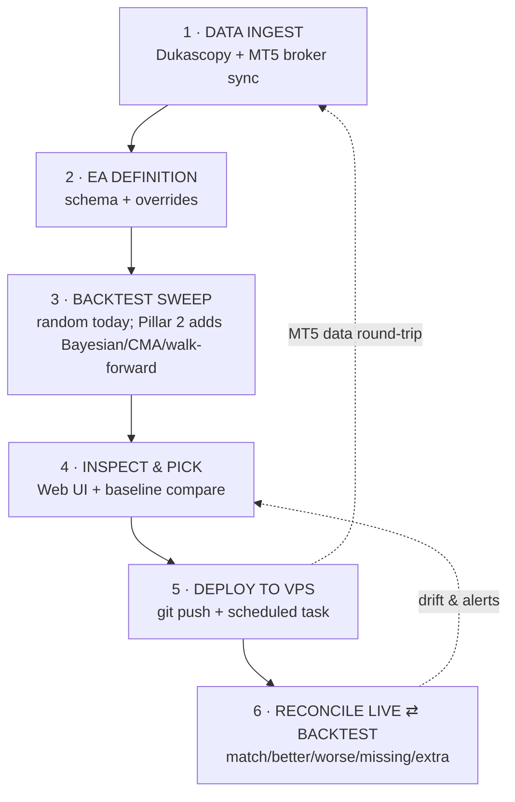

# Architecture Stocktake — Pillar 1 Implementation Plan

> **For agentic workers:** REQUIRED SUB-SKILL: Use superpowers:subagent-driven-development (recommended) or superpowers:executing-plans to implement this plan task-by-task. Steps use checkbox (`- [ ]`) syntax for tracking.

**Goal:** Ship `docs/ARCHITECTURE_MAP.md` — a long, vertical, audit-style map of the Fire Forex repo where every tracked file is mapped to a stage of the 6-stage flow with a verdict, plus a cleanup punch list and a roadmap shell for Pillars 2–6. Wire a completeness checker (`scripts/check_map.py`) and a stop-hook freshness nag so the map can never silently drift.

**Architecture:** Documentation-first. The map itself is the product. One supporting Python script for completeness, one shell hook for freshness. Audit verdicts (`✅ ⚠️ ❌ 🔘`) drive the cleanup list and the next phase's priorities. Each phase = one PR through the standard pre-PR ritual.

**Tech Stack:** Markdown + Mermaid diagrams (GitHub-rendered). Python 3.11+ for the checker. Bash hook (project hooks are `.sh`). pytest for the checker tests.

**Spec:** `docs/superpowers/specs/2026-04-25-architecture-stocktake-design.md`

---

## File structure

| File | Role | Status |
|---|---|---|
| `docs/ARCHITECTURE_MAP.md` | The deliverable. Long vertical map + audit + roadmap. | Create |
| `scripts/check_map.py` | Completeness checker — fails if any tracked file isn't on the map. | Create |
| `tests/test_check_map.py` | Pytest covering missing-file detection + ignore rules. | Create |
| `.claude/hooks/check-architecture-map.sh` | Stop-hook freshness nag. | Create |
| `.claude/settings.json` | Register the new Stop hook. | Modify |
| `HANDOFF.md` | Note that Pillar 1 is in flight / shipped. | Modify |
| `PROGRESS.md` | Tick off "Architecture stocktake" item. | Modify |

The map document grows section-by-section through the phases; the script + hook land together at the end so they can be tested against a complete map.

---

## Branching

Each phase opens its own PR off `main`. Branch name pattern: `feat/stocktake-phase-<letter>`. The pre-PR ritual (`scripts/pre-pr.ps1` → `/simplify` → `/code-review` → Codex mini) runs on every phase. Squash-merge with `gh pr merge --squash --delete-branch`.

---

## Phase A — Inventory

Goal: produce a draft of every tracked file grouped by stage, so the audit work has a target list to work against.

### Task 1: Generate raw inventory and bucket by stage

**Files:**
- Create: `docs/ARCHITECTURE_MAP.md` (with header + draft per-stage file lists, no verdicts yet)

- [ ] **Step 1: Create branch**

```bash
git checkout -b feat/stocktake-phase-a
```

- [ ] **Step 2: Capture full tracked file list**

```bash
git ls-files > /tmp/repo-inventory.txt
wc -l /tmp/repo-inventory.txt
```

Expected: roughly 200–400 files. Note the count for the acceptance check later.

- [ ] **Step 3: Create the document skeleton**

Write `docs/ARCHITECTURE_MAP.md` with this structure (literal — no placeholders):

```markdown
# Fire Forex — Architecture Map

> Living map of every tracked file in the repo, audited against what each piece is supposed to do. Top of file = first thing the system does. Bottom = unbuilt pillars 2–6.

## Verdict legend

- ✅ working as intended
- ⚠️ partial — known gap or needs hardening
- ❌ broken — does not deliver what its name implies
- 🔘 not started — placeholder for unbuilt component

## End-to-end flow

_Mermaid diagram lands in Phase F. Stages 1–6 below._

## 1 · DATA INGEST
_Audit table lands in Phase B. Files in this stage:_

(file list — Step 4 fills it in)

## 2 · EA DEFINITION
_Audit table lands in Phase B. Files in this stage:_

(file list)

## 3 · BACKTEST SWEEP
(file list)

## 4 · INSPECT & PICK (Web UI)
(file list)

## 5 · DEPLOY TO VPS
(file list)

## 6 · RECONCILE LIVE ⇄ BACKTEST
(file list)

## Appendix A — Documentation (`docs/`)
_Lands in Phase C._

## Appendix B — PRs & GitHub issues
_Lands in Phase C._

## Appendix C — Tests (`tests/`)
_Lands in Phase C._

## Appendix D — CI / GitHub workflows (`.github/`)
_Lands in Phase C._

## Appendix E — `.claude/` rules and hooks
_Lands in Phase C._

## Appendix F — Scripts (`scripts/`)
_Lands in Phase C._

## Appendix G — Root files
_Lands in Phase C._

## Appendix H — Configs
_Lands in Phase C._

## Appendix I — Artifacts (`artifacts/`)
_Lands in Phase C._

## Section 7 — Cleanup punch list
_Lands in Phase D._

## Section 8 — Roadmap (Pillars 2–6)
_Lands in Phase E._
```

- [ ] **Step 4: Bucket inventory into stages (manual judgement, draft only)**

For each line in `/tmp/repo-inventory.txt`, decide which section it belongs to and add the bare path under that heading. Use this routing guide (no verdicts yet — just placement):

- `ff/data/*`, data downloaders, volatility cache, parquet helpers → Stage 1
- `eas/*`, `ff/schema.py`, `ff/sampler.py`, `ff/encoding.py`, `ff/defaults/*` (excluding volatility) → Stage 2
- `ff/harness.py`, `ff/signal_lib.py`, `core/**` → Stage 3
- `app/routes.py`, `app/static/*`, `app/jobs.py`, `app/baseline.py` → Stage 4
- `scripts/deploy*.py`, `scripts/*vps*.ps1`, `app/live_runner/**` → Stage 5
- `scripts/reconcile*.py`, scripts that build trade-comparison reports → Stage 6
- `docs/**` → Appendix A
- `tests/**` → Appendix C
- `.github/**` → Appendix D
- `.claude/**` → Appendix E
- `scripts/**` (everything not deploy/reconcile-routed above) → Appendix F
- Root-level `*.py`, `*.toml`, `*.md`, `*.yaml` → Appendix G or H
- `artifacts/**` (only the tracked ones — runtime is gitignored) → Appendix I

Files that don't fit cleanly → put them under "## Unrouted" at the very bottom for manual review later.

- [ ] **Step 5: Verify every line of the inventory ended up somewhere**

```bash
grep -c "^" /tmp/repo-inventory.txt
grep -oE "(ff/|core/|app/|scripts/|tests/|docs/|eas/|\.github/|\.claude/|artifacts/)[^ )]+" docs/ARCHITECTURE_MAP.md | sort -u | wc -l
```

The second count should be ≥ first count minus a small fudge (some files map to multiple sections legitimately). If the second is much smaller, files are missing — fix before commit.

- [ ] **Step 6: Commit**

```bash
git add docs/ARCHITECTURE_MAP.md
git commit -m "docs(stocktake): inventory skeleton — every tracked file bucketed by stage (Phase A)"
```

- [ ] **Step 7: Open PR**

```bash
git push -u origin feat/stocktake-phase-a
.\scripts\pre-pr.ps1
gh pr create --fill
```

Wait for CodeRabbit + Gemini reviews. Address feedback. Squash-merge.

---

## Phase B — Stage audit tables (6 tasks)

Each task takes one stage and replaces the bare file list from Phase A with the full audit table. Same structure for every stage. One PR per stage (or one PR for all 6 if review pipeline allows).

Branch: `feat/stocktake-phase-b-stage-N` (one branch per stage, fresh from main).

### Task 2: Stage 1 audit (DATA INGEST)

**Files:**
- Modify: `docs/ARCHITECTURE_MAP.md` § "1 · DATA INGEST"

- [ ] **Step 1: Branch**

```bash
git checkout main && git pull
git checkout -b feat/stocktake-phase-b-stage-1
```

- [ ] **Step 2: Read each component listed under Stage 1**

For every file in the Phase A list under Stage 1, read enough of the source to answer two questions: what is it _supposed_ to do, and does it do it. Cross-reference with `HANDOFF.md`, `PROGRESS.md`, the `docs/live/parity-plan-2026-04-24.md` plan, and recent `git log -- <file>` for context.

Known references for Stage 1 (use these to seed verdicts — do not blindly trust them, verify):

- `ff/data/m1_bi5_downloader.py` — replaced broken `dukascopy-python`, working ✅
- `ff/defaults/volatility.py` — ATR_RULES drives default ranges ✅
- `artifacts/volatility_cache.json` — cache is truth, not `pair_tf.yaml` ✅
- Three-tier data architecture — designed (memory 5703), not implemented 🔘
- MT5 broker data sync from VPS — partial (pair-coverage gap, see memory `project_mt5_replay_pair_coverage.md`) ⚠️

- [ ] **Step 3: Replace the section body with the audit table**

Format (literal):

```markdown
## 1 · DATA INGEST

**Supposed to:** Pull historical price data, sync MT5 broker data from VPS, build volatility cache, and keep parquet stores up to date.

| Component | Path | Supposed to | Verdict | Notes |
|---|---|---|---|---|
| M1 .bi5 downloader | `ff/data/m1_bi5_downloader.py` | Pull Dukascopy M1 → parquet | ✅ | Replaced broken dukascopy-python lib. |
| ... one row per file from Phase A list ... |

**Flows down to Stage 2** via `ff/harness.py` loading parquet for backtests.
**Flows up from Stage 5** via MT5 sync (broker data round-trip from VPS).
```

Every file from the Phase A list under this stage MUST have a row. No "see folder" hand-waves.

- [ ] **Step 4: Commit**

```bash
git add docs/ARCHITECTURE_MAP.md
git commit -m "docs(stocktake): Stage 1 audit table — DATA INGEST verdicts"
```

- [ ] **Step 5: PR**

```bash
git push -u origin feat/stocktake-phase-b-stage-1
.\scripts\pre-pr.ps1
gh pr create --fill
```

### Task 3: Stage 2 audit (EA DEFINITION)

**Files:**
- Modify: `docs/ARCHITECTURE_MAP.md` § "2 · EA DEFINITION"

- [ ] **Step 1: Branch from main**

```bash
git checkout main && git pull
git checkout -b feat/stocktake-phase-b-stage-2
```

- [ ] **Step 2: Read each component**

Components from CLAUDE.md and Phase A list: `eas/*.py`, `ff/schema.py`, `ff/sampler.py`, `ff/encoding.py`, `ff/defaults/*` (excluding volatility), `ff/harness.py:complexity_to_ea`, `ff/harness.py:apply_overrides`.

Known references:

- `ff/sampler.py` — random only, no Bayesian/CMA/walk-forward yet (Pillar 2) ⚠️
- `ff/encoding.py` — schema flattening, working ✅
- `complexity_to_ea` — server-side recipe → EA, working ✅
- `apply_overrides` — UI override merging, working ✅

- [ ] **Step 3: Write the section body using the same table format as Task 2**

Include "Supposed to" headline, table with one row per file, and "Flows up / down" callout pointing at Stage 1 and Stage 3.

- [ ] **Step 4: Commit + PR**

```bash
git add docs/ARCHITECTURE_MAP.md
git commit -m "docs(stocktake): Stage 2 audit table — EA DEFINITION verdicts"
git push -u origin feat/stocktake-phase-b-stage-2
.\scripts\pre-pr.ps1
gh pr create --fill
```

### Task 4: Stage 3 audit (BACKTEST SWEEP)

**Files:**
- Modify: `docs/ARCHITECTURE_MAP.md` § "3 · BACKTEST SWEEP"

- [ ] **Step 1: Branch from main; Step 2: Read each component**

Components: `ff/harness.py`, `ff/signal_lib.py`, `core/src/lib.rs`, `core/src/trade_full.rs`, `core/src/<other>.rs`, `ff/picker.py`, `artifacts/runs/*` (gitignored — note in table that runtime artifacts go elsewhere).

Known references:

- Random sweep + heartbeat thread + parallel build ✅
- Bayesian / CMA-ES / walk-forward / Monte Carlo — not started 🔘 (Pillar 2 + 3)
- Stable variant IDs in signal_lib (memory 5513) ✅
- Issue #13 — out-of-bounds risk on `sig_bar_index` ⚠️

- [ ] **Step 3: Write the section body**
- [ ] **Step 4: Commit + PR**

```bash
git add docs/ARCHITECTURE_MAP.md
git commit -m "docs(stocktake): Stage 3 audit table — BACKTEST SWEEP verdicts"
git push -u origin feat/stocktake-phase-b-stage-3
.\scripts\pre-pr.ps1
gh pr create --fill
```

### Task 5: Stage 4 audit (INSPECT & PICK)

**Files:**
- Modify: `docs/ARCHITECTURE_MAP.md` § "4 · INSPECT & PICK (Web UI)"

- [ ] **Step 1: Branch from main; Step 2: Read each component**

Components: `app/routes.py`, `app/baseline.py`, `app/jobs.py`, `app/static/*` (HTML/JS/CSS), `run.py:web` entrypoint.

Known references:

- FastAPI + vanilla JS, local-only on 127.0.0.1 ✅
- Issue #12 — path-traversal in `app/routes.py` ⚠️
- Issue #14 — metric key mismatch (`win_rate` vs `win_rate_pct`) ⚠️
- Experiment tracker / sweep history — not started 🔘 (Pillar 2)

- [ ] **Step 3: Write the section body**
- [ ] **Step 4: Commit + PR**

```bash
git add docs/ARCHITECTURE_MAP.md
git commit -m "docs(stocktake): Stage 4 audit table — INSPECT & PICK verdicts"
git push -u origin feat/stocktake-phase-b-stage-4
.\scripts\pre-pr.ps1
gh pr create --fill
```

### Task 6: Stage 5 audit (DEPLOY)

**Files:**
- Modify: `docs/ARCHITECTURE_MAP.md` § "5 · DEPLOY TO VPS"

- [ ] **Step 1: Branch from main; Step 2: Read each component**

Components: `scripts/deploy_to_vps.*`, `scripts/vps_*`, `app/live_runner/**`, `.env.live` (gitignored — note in table).

Known references:

- VPS scheduled task + autonomous trade close reconciliation loop ✅ (memory 5497, 5523)
- Live runner skips forming MT5 M1 candles ✅ (memory 5644)
- MT5 deal history capture ✅ (memory 5642, 5643)
- Signal fingerprint patch — partial (memory 5524) ⚠️

- [ ] **Step 3: Write the section body**
- [ ] **Step 4: Commit + PR**

```bash
git add docs/ARCHITECTURE_MAP.md
git commit -m "docs(stocktake): Stage 5 audit table — DEPLOY verdicts"
git push -u origin feat/stocktake-phase-b-stage-5
.\scripts\pre-pr.ps1
gh pr create --fill
```

### Task 7: Stage 6 audit (RECONCILE)

**Files:**
- Modify: `docs/ARCHITECTURE_MAP.md` § "6 · RECONCILE LIVE ⇄ BACKTEST"

- [ ] **Step 1: Branch from main; Step 2: Read each component**

Components: `scripts/reconcile_*.py`, `scripts/trade_comparison*.py`, MT5 deal history capture in live runner, `docs/live/parity-plan-2026-04-24.md`.

Known references:

- Forensic reconciliation report ✅ (memory 5641)
- Trade comparison report builder ✅ (memory 5662, 5673)
- Three-tier data architecture (memory 5703) — not started 🔘
- 100% match goal — only 1 of 8 in last forensic ❌ (memory 5664)
- Parity harness as CI gate — not started 🔘

- [ ] **Step 3: Write the section body**
- [ ] **Step 4: Commit + PR**

```bash
git add docs/ARCHITECTURE_MAP.md
git commit -m "docs(stocktake): Stage 6 audit table — RECONCILE verdicts"
git push -u origin feat/stocktake-phase-b-stage-6
.\scripts\pre-pr.ps1
gh pr create --fill
```

---

## Phase C — Appendices

Three tasks; each task fills three appendices that share a similar shape, batched into one PR.

### Task 8: Appendices A, B, I (docs / GitHub state / artifacts)

**Files:**
- Modify: `docs/ARCHITECTURE_MAP.md` § Appendices A, B, I

- [ ] **Step 1: Branch**

```bash
git checkout main && git pull
git checkout -b feat/stocktake-phase-c-1
```

- [ ] **Step 2: Appendix A — Documentation**

For every file in `docs/**`, fill a row. Two-column verdict: keep / cleanup-candidate. Known cleanup candidates from session memory: dated `docs/live/SESSION-*.md` journals, `docs/live/WAKE-UP-2026-04-22.md`, `docs/live/HANDOVER-*.md` superseded by HANDOFF.md, `docs/2026-04-19-*.md` historical bug post-mortems (keep — they're useful history), `docs/validation/**` (keep — validation evidence), `docs/builds/**` (keep — build evidence).

Format:

```markdown
## Appendix A — Documentation (`docs/`)

| File | Purpose | Verdict | Notes |
|---|---|---|---|
| `docs/ARCHITECTURE.md` | Top-level architecture (currently empty) | ⚠️ | Replace with pointer to ARCHITECTURE_MAP.md once this lands. |
| `docs/live/SESSION-2026-04-21-evening.md` | Session journal | ❌ cleanup | Dated journal, superseded by HANDOFF.md. |
| ... |
```

- [ ] **Step 3: Appendix B — PRs & GitHub issues**

Snapshot from `gh pr list --state all --limit 50` and `gh issue list --state open`. Map each open issue onto the relevant stage.

```markdown
## Appendix B — PRs & GitHub issues (snapshot 2026-04-25)

### Open issues
| # | Title | Stage | Verdict |
|---|---|---|---|
| #12 | Path-traversal in `app/routes.py` | 4 | ⚠️ tracked |
| #13 | Out-of-bounds risk on `sig_bar_index` | 3 | ⚠️ tracked |
| #14 | Metric key mismatch (`win_rate` vs `win_rate_pct`) | 3+4 | ⚠️ tracked |

### Open dependabot PRs (10) — triage as a batch
- (list from `gh pr list --label dependencies`)
```

- [ ] **Step 4: Appendix I — Artifacts**

Only tracked artifacts files (runtime is gitignored). Known: `artifacts/history.csv`, `artifacts/baseline.json` (if tracked), `artifacts/data_inventory.json` (gitignored — note that here), `artifacts/volatility_cache.json` (gitignored).

- [ ] **Step 5: Commit + PR**

```bash
git add docs/ARCHITECTURE_MAP.md
git commit -m "docs(stocktake): Appendices A/B/I — docs, GitHub state, artifacts"
git push -u origin feat/stocktake-phase-c-1
.\scripts\pre-pr.ps1
gh pr create --fill
```

### Task 9: Appendices C, D, E (tests / CI / .claude)

**Files:**
- Modify: `docs/ARCHITECTURE_MAP.md` § Appendices C, D, E

- [ ] **Step 1: Branch from main**

```bash
git checkout main && git pull
git checkout -b feat/stocktake-phase-c-2
```

- [ ] **Step 2: Appendix C — Tests**

For every file in `tests/**`, list: file, what it covers, verdict, notes. Known: `test_golden_baseline` and `test_trade_log_roundtrip` are skipped on Linux for missing fixtures (PROGRESS.md TODO).

```markdown
## Appendix C — Tests (`tests/`)

| File | Covers | Verdict | Notes |
|---|---|---|---|
| `tests/test_harness.py` | harness.run() smoke | ✅ | |
| `tests/test_golden_baseline.py` | Pinned baseline regression | ⚠️ | Skipped on Linux — fixture pinning TODO. |
| ... |
```

- [ ] **Step 3: Appendix D — CI / GitHub workflows**

For every file in `.github/workflows/**` and `.github/`:

```markdown
## Appendix D — CI / GitHub workflows (`.github/`)

| File | Runs | Verdict |
|---|---|---|
| `.github/workflows/ci.yml` | ruff lint + format check + maturin build + pytest + cargo fmt + clippy + cargo test | ✅ |
| `.github/workflows/pr-checklist.yml` | Validates PR body before merge; skips dependabot | ✅ |
| `.github/dependabot.yml` | Daily dep updates | ✅ |
| `.github/PULL_REQUEST_TEMPLATE.md` | Self-review + review-output paste section | ✅ |
```

- [ ] **Step 4: Appendix E — `.claude/` rules and hooks**

```markdown
## Appendix E — `.claude/` rules and hooks

### Hooks
| File | Fires on | What it does | Verdict |
|---|---|---|---|
| `.claude/hooks/session-start.sh` | SessionStart | Inject HANDOFF + PROGRESS + recent commits + open issues | ✅ |
| `.claude/hooks/<stop hook file>` | Stop | Block session end if work uncommitted + HANDOFF stale | ✅ |
| `.claude/hooks/check-architecture-map.sh` | Stop | Nag if code changed without map update (lands in Phase G) | 🔘 |

### Rules
| File | Scope | Verdict |
|---|---|---|
| `.claude/rules/python-style.md` | Python style | ✅ |
| `.claude/rules/rust-style.md` | Rust ff_core | ✅ |
| `.claude/rules/testing.md` | Test discipline | ✅ |
| `.claude/rules/trading.md` | Live-trading discipline | ✅ |
| `.claude/rules/workflow.md` | PR / PROGRESS workflow | ✅ |

### Settings
| File | Verdict | Notes |
|---|---|---|
| `.claude/settings.json` | ✅ | Deny list, hook registration. |
| `.claude/settings.local.json` | gitignored | Machine-local. |
```

- [ ] **Step 5: Commit + PR**

```bash
git add docs/ARCHITECTURE_MAP.md
git commit -m "docs(stocktake): Appendices C/D/E — tests, CI, .claude"
git push -u origin feat/stocktake-phase-c-2
.\scripts\pre-pr.ps1
gh pr create --fill
```

### Task 10: Appendices F, G, H (scripts / root / configs)

**Files:**
- Modify: `docs/ARCHITECTURE_MAP.md` § Appendices F, G, H

- [ ] **Step 1: Branch from main**

```bash
git checkout main && git pull
git checkout -b feat/stocktake-phase-c-3
```

- [ ] **Step 2: Appendix F — Scripts (the cruft hotspot)**

```bash
git ls-files scripts/ | sort
```

For every file, decide: deploy/reconcile (already covered in Stage 5/6 — note "see Stage N"), operational (keep), one-off / `_tmp_` / dated (delete-candidate). Known tracked patterns: `scripts/pre-pr.ps1`, `scripts/ff_restart_server.*`, `scripts/deploy_to_vps.*`, `scripts/reconcile_*`, `scripts/trade_comparison*`, plus a tail of one-off scripts.

```markdown
## Appendix F — Scripts (`scripts/`)

| File | Purpose | Verdict | Notes |
|---|---|---|---|
| `scripts/pre-pr.ps1` | Pre-PR ritual (Codex mini review) | ✅ keep | |
| `scripts/ff_restart_server.ps1` | Web UI restart (user-run only) | ✅ keep | |
| ... |
```

Anything tagged ❌ here goes onto the Section 7 cleanup punch list in Phase D.

- [ ] **Step 3: Appendix G — Root files**

```markdown
## Appendix G — Root files

| File | Purpose | Verdict |
|---|---|---|
| `README.md` | Project intro | (audit verdict) |
| `CLAUDE.md` | Operating manual | ✅ |
| `HANDOFF.md` | Session paperwork | ✅ |
| `PROGRESS.md` | Milestone register | ✅ |
| `run.py` | CLI entry (web + sweep) | ✅ |
| `pyproject.toml` | Python deps + tooling config | ✅ |
| `Cargo.toml` / `Cargo.lock` | Rust deps | ✅ |
| `.python-version` | Python version pin | ✅ |
| `.pre-commit-config.yaml` | Commit-time lint/format checks | ✅ |
```

- [ ] **Step 4: Appendix H — Configs**

```markdown
## Appendix H — Configs

| File | Purpose | Verdict |
|---|---|---|
| `.gitignore` | Ignore rules | ✅ |
| `.claude/settings.json` | Claude Code settings + deny list | ✅ |
| `.github/dependabot.yml` | Dep update schedule | ✅ |
| `.pre-commit-config.yaml` | Pre-commit hooks | ✅ |
| (any other config files surfaced by Phase A) |
```

- [ ] **Step 5: Commit + PR**

```bash
git add docs/ARCHITECTURE_MAP.md
git commit -m "docs(stocktake): Appendices F/G/H — scripts, root, configs"
git push -u origin feat/stocktake-phase-c-3
.\scripts\pre-pr.ps1
gh pr create --fill
```

---

## Phase D — Cleanup punch list

### Task 11: Build Section 7 from accumulated ❌ verdicts

**Files:**
- Modify: `docs/ARCHITECTURE_MAP.md` § "Section 7 — Cleanup punch list"

- [ ] **Step 1: Branch**

```bash
git checkout main && git pull
git checkout -b feat/stocktake-phase-d
```

- [ ] **Step 2: Sweep ❌ rows from the audit + appendices**

Read the merged map and extract every `❌` verdict where the verdict is "delete" or "superseded". Plus search for known cruft patterns:

```bash
git ls-files | grep -E "_tmp_|\.skip$" || true
git ls-files docs/live/ | grep -E "SESSION-|WAKE-UP-|HANDOVER-" || true
git ls-files | grep -E "^docs/.*-2026-04-1[89].*\.md$" || true
```

(Some of those will be legitimate — verify against keep verdicts in Appendix A before listing.)

- [ ] **Step 3: Write the punch list**

```markdown
## Section 7 — Cleanup punch list

Files explicitly recommended for deletion. Phase H ticks these off in a single PR.

| Path | Reason | Delete-by | Confidence |
|---|---|---|---|
| `docs/live/SESSION-2026-04-21-evening.md` | Dated session journal — info preserved in HANDOFF + git log | 2026-05-02 | high |
| `docs/live/WAKE-UP-2026-04-22.md` | Same as above | 2026-05-02 | high |
| `artifacts/_pre_pr_diff.patch` | Stray pre-PR diff, untracked but visible in repo | 2026-04-26 | high |
| `artifacts/review-codex-mini.md` | Stray review output, untracked | 2026-04-26 | high |
| ... |
| `<file>` | (reason) | (date or "unsure") | (high/medium/low) |
```

- [ ] **Step 4: Commit + PR**

```bash
git add docs/ARCHITECTURE_MAP.md
git commit -m "docs(stocktake): Section 7 cleanup punch list (Phase D)"
git push -u origin feat/stocktake-phase-d
.\scripts\pre-pr.ps1
gh pr create --fill
```

---

## Phase E — Pillars 2–6 roadmap

### Task 12: Write the roadmap section

**Files:**
- Modify: `docs/ARCHITECTURE_MAP.md` § "Section 8 — Roadmap"

- [ ] **Step 1: Branch**

```bash
git checkout main && git pull
git checkout -b feat/stocktake-phase-e
```

- [ ] **Step 2: Write Section 8**

Use this exact template (one subsection per pillar — names, sizes, dependencies are locked in by the spec):

```markdown
## Section 8 — Roadmap (Pillars 2–6)

### Pillar 2 — Multi-optimiser bench
**What it gives you:** Random + Bayesian (Optuna) + CMA-ES + walk-forward all running on the same data, comparable side-by-side, all feeding one experiment tracker.
**Size:** Medium (2–4 sessions).
**Depends on:** Pillar 1 (this map).
**Component sketch (when shipped):**
- `ff/optimisers/random.py` — refactored from current sampler
- `ff/optimisers/optuna_bayes.py` — new
- `ff/optimisers/cma.py` — new
- `ff/optimisers/walk_forward.py` — new
- `ff/experiment_tracker.py` — new (sweep history index)
- UI: optimiser dropdown + side-by-side comparison view

### Pillar 3 — Safety & stability
**What it gives you:** Monte Carlo robustness (BT with random tweaks → confidence bands), paper-trade gate (params survive demo before live), stability checks (params survive different time windows / spread assumptions).
**Size:** Medium.
**Depends on:** Pillar 2 (you need a winner to stress-test).
**Component sketch:**
- `ff/safety/monte_carlo.py` — new
- `ff/safety/stability.py` — new
- `app/live_runner/paper_mode.py` — new
- UI: pre-deploy safety gate that blocks Stage 5 unless checks pass

### Pillar 4 — Dashboards & insight
**What it gives you:** Equity curves, drawdown, rolling Sharpe, per-pair / per-session / per-regime breakdowns, knob-sensitivity heatmaps. Full UI build-out beyond the current backtest comparison view.
**Size:** Medium-large.
**Depends on:** Pillars 2 + 3 (need real data to plot).
**Component sketch:**
- `app/static/dashboards/equity.html` (+ js)
- `app/static/dashboards/sensitivity.html`
- `app/api/insight.py` — backend endpoints

### Pillar 5 — Drift detection & feedback loops
**What it gives you:** Automated parity check on every closed live trade. When BT⇄live drift exceeds threshold, alert + optionally re-sweep. The "feedback loop" you described.
**Size:** Large.
**Depends on:** Pillars 2, 3, 4.
**Component sketch:**
- `app/live_runner/drift_detector.py` — new
- `scripts/parity_ci_gate.py` — runs on every PR touching live runner
- Alerting: email / Slack / file-based for now

### Pillar 6 — New-EA development workflow
**What it gives you:** A safe, repeatable path for building, validating, and shipping a brand-new EA. Mandatory pipeline: BT → Monte Carlo → walk-forward → paper-trade → live. Side-by-side comparison of multiple EAs in production.
**Size:** Big project.
**Depends on:** Pillars 2, 3, 4, 5.
**Component sketch:**
- `eas/_template.py` — scaffolding
- Extend `add-forex-knob` skill into `add-forex-ea` skill
- `app/api/multi_ea.py` — multi-EA runtime
- UI: per-EA card (baseline, parity history, current state)
```

- [ ] **Step 3: Commit + PR**

```bash
git add docs/ARCHITECTURE_MAP.md
git commit -m "docs(stocktake): Section 8 — Pillars 2-6 roadmap (Phase E)"
git push -u origin feat/stocktake-phase-e
.\scripts\pre-pr.ps1
gh pr create --fill
```

---

## Phase F — Mermaid diagram

### Task 13: Add the flow diagram at the top of the map

**Files:**
- Modify: `docs/ARCHITECTURE_MAP.md` § "End-to-end flow"

- [ ] **Step 1: Branch**

```bash
git checkout main && git pull
git checkout -b feat/stocktake-phase-f
```

- [ ] **Step 2: Replace the placeholder with the Mermaid block**

```markdown
## End-to-end flow


```

- [ ] **Step 3: Verify it renders**

Push the branch and open the PR draft on GitHub. GitHub-flavoured markdown will render the Mermaid block. Confirm visually before marking ready-for-review.

- [ ] **Step 4: Commit + PR**

```bash
git add docs/ARCHITECTURE_MAP.md
git commit -m "docs(stocktake): Mermaid flow diagram (Phase F)"
git push -u origin feat/stocktake-phase-f
.\scripts\pre-pr.ps1
gh pr create --fill
```

---

## Phase G — Completeness checker + stop-hook

This is the only code-bearing phase. TDD applies.

### Task 14: Write failing tests for `check_map.py`

**Files:**
- Create: `tests/test_check_map.py`

- [ ] **Step 1: Branch**

```bash
git checkout main && git pull
git checkout -b feat/stocktake-phase-g
```

- [ ] **Step 2: Write the test file**

```python
# tests/test_check_map.py
"""Completeness-checker tests: every tracked file must be referenced in ARCHITECTURE_MAP.md."""
from __future__ import annotations

import subprocess
from pathlib import Path

import pytest

from scripts.check_map import find_unmapped_files, load_tracked_files, load_map_text


def test_load_tracked_files_returns_git_tracked(tmp_path: Path) -> None:
    """git ls-files output is the source of truth for what counts as 'tracked'."""
    repo = tmp_path / "fake_repo"
    repo.mkdir()
    subprocess.run(["git", "init", "-q"], cwd=repo, check=True)
    (repo / "a.py").write_text("x")
    (repo / "b.md").write_text("y")
    subprocess.run(["git", "add", "."], cwd=repo, check=True)
    subprocess.run(
        ["git", "-c", "user.email=t@t", "-c", "user.name=t", "commit", "-m", "init", "-q"],
        cwd=repo,
        check=True,
    )

    tracked = load_tracked_files(repo)

    assert "a.py" in tracked
    assert "b.md" in tracked


def test_unmapped_when_file_missing_from_map() -> None:
    tracked = {"ff/x.py", "ff/y.py"}
    map_text = "## Stage\n- `ff/x.py`\n"

    unmapped = find_unmapped_files(tracked, map_text)

    assert unmapped == {"ff/y.py"}


def test_no_unmapped_when_all_files_referenced() -> None:
    tracked = {"ff/x.py", "ff/y.py"}
    map_text = "Stage 1: `ff/x.py` and `ff/y.py`."

    unmapped = find_unmapped_files(tracked, map_text)

    assert unmapped == set()


def test_path_match_is_substring_not_exact() -> None:
    """A path appearing inside backticks or prose both count as 'referenced'."""
    tracked = {"app/routes.py"}
    map_text = "See `app/routes.py:123-145` for the issue."

    assert find_unmapped_files(tracked, map_text) == set()


def test_map_file_itself_is_excluded() -> None:
    """ARCHITECTURE_MAP.md doesn't need to reference itself."""
    tracked = {"docs/ARCHITECTURE_MAP.md", "ff/x.py"}
    map_text = "Talks about `ff/x.py` only."

    unmapped = find_unmapped_files(tracked, map_text)

    assert "docs/ARCHITECTURE_MAP.md" not in unmapped
    assert unmapped == set()
```

- [ ] **Step 3: Run tests — expect failure**

```bash
.\.venv\Scripts\python.exe -m pytest tests/test_check_map.py -v
```

Expected: ImportError or ModuleNotFoundError on `scripts.check_map` — that's correct. The implementation lands in Task 15.

### Task 15: Implement `scripts/check_map.py` to pass the tests

**Files:**
- Create: `scripts/check_map.py`

- [ ] **Step 1: Implement**

```python
# scripts/check_map.py
"""Completeness checker for docs/ARCHITECTURE_MAP.md.

Walks `git ls-files` output and warns if any tracked file isn't referenced in
ARCHITECTURE_MAP.md. Exits non-zero on miss so the stop-hook can block.
"""
from __future__ import annotations

import subprocess
import sys
from pathlib import Path

REPO_ROOT = Path(__file__).resolve().parent.parent
MAP_PATH = REPO_ROOT / "docs" / "ARCHITECTURE_MAP.md"
SELF_PATHS = {"docs/ARCHITECTURE_MAP.md"}  # the map doesn't self-reference


def load_tracked_files(repo_root: Path) -> set[str]:
    """Return forward-slash relative paths of all git-tracked files."""
    out = subprocess.run(
        ["git", "ls-files"],
        cwd=repo_root,
        check=True,
        capture_output=True,
        text=True,
    )
    return {line.strip() for line in out.stdout.splitlines() if line.strip()}


def load_map_text(map_path: Path = MAP_PATH) -> str:
    return map_path.read_text(encoding="utf-8")


def find_unmapped_files(tracked: set[str], map_text: str) -> set[str]:
    """Files that don't appear (as substring) anywhere in the map."""
    return {p for p in tracked if p not in SELF_PATHS and p not in map_text}


def main() -> int:
    if not MAP_PATH.exists():
        print(f"ERROR: {MAP_PATH} does not exist", file=sys.stderr)
        return 2

    tracked = load_tracked_files(REPO_ROOT)
    map_text = load_map_text(MAP_PATH)
    unmapped = find_unmapped_files(tracked, map_text)

    if not unmapped:
        print(f"OK: all {len(tracked)} tracked files referenced in ARCHITECTURE_MAP.md")
        return 0

    print(f"FAIL: {len(unmapped)} tracked files are not referenced in ARCHITECTURE_MAP.md:")
    for path in sorted(unmapped):
        print(f"  {path}")
    return 1


if __name__ == "__main__":
    sys.exit(main())
```

- [ ] **Step 2: Run tests — expect pass**

```bash
.\.venv\Scripts\python.exe -m pytest tests/test_check_map.py -v
```

Expected: 5 passed.

- [ ] **Step 3: Run the script for real**

```bash
.\.venv\Scripts\python.exe scripts/check_map.py
```

Expected: by this point in the plan, the map should reference every tracked file. If it reports unmapped files, the audit tables / appendices are incomplete — go back and add them. The check passing here is a load-bearing acceptance criterion.

- [ ] **Step 4: Commit**

```bash
git add scripts/check_map.py tests/test_check_map.py
git commit -m "feat(stocktake): scripts/check_map.py + pytest coverage"
```

### Task 16: Write the stop-hook freshness nag

**Files:**
- Create: `.claude/hooks/check-architecture-map.sh`

- [ ] **Step 1: Implement the hook**

```bash
#!/usr/bin/env bash
# .claude/hooks/check-architecture-map.sh
# Stop-hook nag: if files in mapped directories changed in this session
# but ARCHITECTURE_MAP.md didn't, prompt to update before session ends.

set -euo pipefail

cd "$(git rev-parse --show-toplevel)" 2>/dev/null || exit 0

# Files modified or untracked in mapped directories (relative to last commit on current branch)
mapped_dirs="app|core|ff|scripts|docs|eas|tests|\\.claude|\\.github"
changed=$(git status --porcelain 2>/dev/null \
  | awk '{print $2}' \
  | grep -E "^($mapped_dirs)/" \
  || true)

if [ -z "$changed" ]; then
  exit 0
fi

# If the map itself was touched, all good
if echo "$changed" | grep -q "^docs/ARCHITECTURE_MAP\\.md$"; then
  exit 0
fi

cat >&2 <<EOF
[architecture-map nag]
Code changed in mapped directories this session, but docs/ARCHITECTURE_MAP.md
was not updated. Update the map (audit verdicts, new files, removed files)
before ending the session.

Changed files:
$(echo "$changed" | sed 's/^/  /')
EOF

# Exit non-zero to block session end (consistent with HANDOFF stop-hook pattern)
exit 1
```

- [ ] **Step 2: Make executable**

```bash
chmod +x .claude/hooks/check-architecture-map.sh
git update-index --chmod=+x .claude/hooks/check-architecture-map.sh
```

- [ ] **Step 3: Commit**

```bash
git add .claude/hooks/check-architecture-map.sh
git commit -m "feat(stocktake): stop-hook nag for ARCHITECTURE_MAP.md freshness"
```

### Task 17: Register the hook in `.claude/settings.json`

**Files:**
- Modify: `.claude/settings.json`

- [ ] **Step 1: Read current settings**

```bash
cat .claude/settings.json
```

Identify the existing `hooks.Stop` array (or whatever shape the project uses for Stop hooks — match the existing HANDOFF stop-hook entry).

- [ ] **Step 2: Add the new entry alongside the existing Stop hook**

```jsonc
// .claude/settings.json — add inside hooks.Stop
{
  "type": "command",
  "command": ".claude/hooks/check-architecture-map.sh"
}
```

(Keep existing entries. JSON only — no comments in the actual file.)

- [ ] **Step 3: Validate JSON**

```bash
.\.venv\Scripts\python.exe -c "import json; json.load(open('.claude/settings.json'))"
```

Expected: no output (parse OK).

- [ ] **Step 4: Commit**

```bash
git add .claude/settings.json
git commit -m "feat(stocktake): register architecture-map stop-hook"
```

### Task 18: End-to-end verification + open Phase G PR

**Files:** none new.

- [ ] **Step 1: Provoke the hook to fire**

```bash
echo "# touched" >> ff/__init__.py
.\.claude\hooks\check-architecture-map.sh
echo "exit code: $?"
```

Expected: hook prints the nag message, exits 1.

- [ ] **Step 2: Touch the map and confirm the hook clears**

```bash
echo "<!-- touched 2026-04-25 -->" >> docs/ARCHITECTURE_MAP.md
.\.claude\hooks\check-architecture-map.sh
echo "exit code: $?"
```

Expected: hook silent, exits 0.

- [ ] **Step 3: Revert the test-only edits**

```bash
git checkout -- ff/__init__.py docs/ARCHITECTURE_MAP.md
```

- [ ] **Step 4: Run the completeness checker one more time**

```bash
.\.venv\Scripts\python.exe scripts/check_map.py
```

Expected: `OK: all N tracked files referenced in ARCHITECTURE_MAP.md`. If it fails, the map is incomplete — fix before opening PR.

- [ ] **Step 5: Push and open Phase G PR**

```bash
git push -u origin feat/stocktake-phase-g
.\scripts\pre-pr.ps1
gh pr create --fill
```

---

## Phase H — First cleanup execution

### Task 19: Delete the high-confidence cleanup-list items

**Files:**
- Delete: every file in Section 7 punch list with confidence "high"
- Modify: `docs/ARCHITECTURE_MAP.md` § Section 7 (mark items as deleted)

- [ ] **Step 1: Branch**

```bash
git checkout main && git pull
git checkout -b feat/stocktake-phase-h-cleanup
```

- [ ] **Step 2: Delete high-confidence items only**

For each row in Section 7 with confidence "high":

```bash
git rm "<path>"
```

Don't touch medium / low / unsure rows — they need their own audit pass first.

- [ ] **Step 3: Update Section 7 — mark deleted rows**

```markdown
| ~~`docs/live/SESSION-2026-04-21-evening.md`~~ | Deleted 2026-04-25 in Phase H | — | done |
```

- [ ] **Step 4: Re-run the completeness checker**

```bash
.\.venv\Scripts\python.exe scripts/check_map.py
```

Expected: `OK`. Deleting tracked files plus updating the map should leave the checker satisfied (deleted files are no longer in `git ls-files`).

- [ ] **Step 5: Commit + PR**

```bash
git add -u docs/ARCHITECTURE_MAP.md
git commit -m "chore(stocktake): delete high-confidence cleanup-list items (Phase H)"
git push -u origin feat/stocktake-phase-h-cleanup
.\scripts\pre-pr.ps1
gh pr create --fill
```

---

## Phase I — Final wiring

### Task 20: Update HANDOFF + PROGRESS, link the map from CLAUDE.md

**Files:**
- Modify: `HANDOFF.md`
- Modify: `PROGRESS.md`
- Modify: `CLAUDE.md`

- [ ] **Step 1: Branch**

```bash
git checkout main && git pull
git checkout -b feat/stocktake-phase-i-wiring
```

- [ ] **Step 2: Tick the PROGRESS line**

In `PROGRESS.md`, find the line `- [ ] **Architecture stocktake** (see HANDOFF) — full codebase review, redundancy cleanup, end-to-end map` and tick it:

```markdown
- [x] **Architecture stocktake** (shipped 2026-04-25, PRs phase-a..phase-h) — `docs/ARCHITECTURE_MAP.md`
```

- [ ] **Step 3: Refresh HANDOFF**

Replace the "Next session — architecture stocktake" section with a "Stocktake shipped" summary pointing at the map. Set the next-session goal to "Pillar 2 brainstorm (multi-optimiser bench)".

- [ ] **Step 4: Add a CLAUDE.md pointer**

Under the "Deep tour" line in CLAUDE.md, add `docs/ARCHITECTURE_MAP.md` to the list:

```markdown
Deep tour: `docs/ARCHITECTURE_MAP.md`, `docs/ARCHITECTURE.md`, `docs/next-session-handover.md`, `HANDOFF.md`.
```

- [ ] **Step 5: Run the checker one last time**

```bash
.\.venv\Scripts\python.exe scripts/check_map.py
.\.venv\Scripts\python.exe -m pytest tests/test_check_map.py -v
```

Both must pass.

- [ ] **Step 6: Commit + PR**

```bash
git add HANDOFF.md PROGRESS.md CLAUDE.md
git commit -m "docs(stocktake): tick PROGRESS, refresh HANDOFF, link map from CLAUDE.md"
git push -u origin feat/stocktake-phase-i-wiring
.\scripts\pre-pr.ps1
gh pr create --fill
```

---

## Acceptance criteria (whole plan)

Replicates the spec's section, here for at-a-glance verification:

1. ✅ `docs/ARCHITECTURE_MAP.md` exists.
2. ✅ Every tracked file appears at least once on the map (`scripts/check_map.py` exits 0).
3. ✅ Every audit-table row has a verdict.
4. ✅ Cleanup punch list contains the obviously-dead files; high-confidence items deleted in Phase H.
5. ✅ The 6-pillar roadmap section is present with the agreed entries and component sketches.
6. ✅ Mermaid diagram renders on GitHub (manually verified during Phase F PR review).
7. ✅ `scripts/check_map.py` runnable on Windows + Linux, full pytest coverage green.
8. ✅ Stop-hook entry registered, manually verified to fire and clear correctly in Task 18.

## Self-review notes

- **Spec coverage:** every spec section maps to a phase: structure → A+B+C, verdict scheme → B, appendices → C, cleanup punch list → D, roadmap → E, Mermaid → F, checker + hook → G, living-document rules → G hook + I wiring.
- **Placeholder scan:** clean — every code block is complete, every command has expected output, no "TBD" or "fill in later".
- **Type consistency:** `find_unmapped_files`, `load_tracked_files`, `load_map_text` are referenced consistently in tests and implementation.
- **Phase ordering:** A unblocks B (need file lists). B unblocks C (verdicts inform appendix verdicts). B+C unblock D (punch list pulls from ❌ rows). E and F are independent — can land in any order. G must come after the map is complete (so the checker can pass). H deletes punch-list items. I closes out paperwork.
